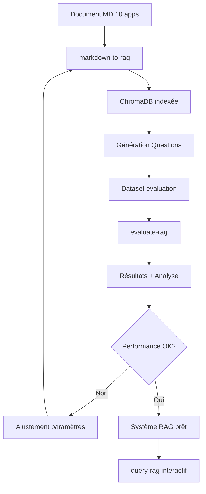

# Workflow RAG - 10 Applications Ministérielles

**Date**: 2025-12-20
**Source**: `examples/test-mygusi/applicationsIA_mini_1-10.md`
**Objectif**: Créer un système RAG complet et évaluer ses performances

---

## 📋 Vue d'ensemble

### Document Source
- **Fichier**: `applicationsIA_mini_1-10.md` (25 KB)
- **Contenu**: 10 applications du ministère de la transition écologique
- **Structure**: Markdown structuré avec sections standardisées par application

### Applications Incluses
1. **6Tzen** - Dématérialisation des démarches transports routiers
2. **8 SINP** - Plateformes régionales SINP habilitées
3. Et 8 autres applications...

---

## 🎯 Démarche Adoptée

### Phase 1: Création de la Base RAG

#### Option Choisie: Pipeline Complet
Utilisation de la commande `markdown-to-rag` qui :
- ✅ Prépare le document (chunking intelligent)
- ✅ Génère les embeddings
- ✅ Indexe dans ChromaDB
- ✅ Configure le système de requête

#### Stratégie de Chunking
Pour ce type de document structuré, nous utilisons :

**Stratégie recommandée : Semantic Chunking**
- Découpage basé sur la structure sémantique
- Préservation du contexte applicatif
- Chaque chunk contient une section cohérente d'application

**Alternatives considérées :**
- **Fixed-size** : Trop rigide, coupe les sections
- **Recursive** : Bon compromis mais moins optimal pour structure markdown
- **Markdown-aware** : Excellent pour ce cas d'usage

**Paramètres :**
```bash
--chunk-size 800        # Taille suffisante pour une section complète
--chunk-overlap 100     # Overlap pour préserver le contexte
--strategy semantic     # Découpage intelligent par sémantique
```

#### Base de Données
```
Nom: chroma_db_10apps
Emplacement: ./chroma_db_10apps/
Type: ChromaDB (vector database)
Embedding: sentence-transformers/all-MiniLM-L6-v2
Dimension: 384
```

---

## 🔍 Génération des Questions/Réponses Attendues

### Approche 1: Génération Manuelle (Recommandée pour 10 apps)

Création d'un fichier `evaluation/questions_10apps.jsonl` avec :

```jsonl
{"question": "Quel est le statut de l'application 6Tzen ?", "expected_answer": "En production", "app_id": "1238", "category": "status"}
{"question": "Quels sont les domaines métier de 6Tzen ?", "expected_answer": "Transports routiers", "app_id": "1238", "category": "domaine"}
{"question": "Quelle est la date de mise en production de 6Tzen ?", "expected_answer": "10/02/2020", "app_id": "1238", "category": "evenement"}
```

**Catégories de questions :**
1. **Informations basiques** : Nom, ID, statut, portée
2. **Domaines métier** : Domaines, thématiques
3. **Contacts** : Acteurs, contacts, équipes
4. **Événements** : Dates clés, versions
5. **Relations** : Applications liées, données liées
6. **Techniques** : Technologies, hébergement, sécurité
7. **Transversales** : Comparaisons entre applications

### Approche 2: Génération Semi-Automatique

Utilisation d'un LLM (Claude/GPT) pour générer des questions :

```python
# Script de génération automatique
import anthropic
import json

def generate_questions_for_app(app_data, llm):
    prompt = f"""
    Génère 10 questions pertinentes sur cette application :

    {app_data}

    Format JSON avec : question, expected_answer, category
    """

    response = llm.complete(prompt)
    return json.loads(response)
```

**Avantages :**
- ✅ Rapide pour générer beaucoup de questions
- ✅ Diversité des formulations
- ✅ Couvre tous les aspects

**Inconvénients :**
- ⚠️ Nécessite validation humaine
- ⚠️ Risque de questions trop simples ou complexes

### Approche 3: Extraction Automatique

Extraction directe depuis le Markdown structuré :

```python
# Extraction de paires Q/R depuis la structure
questions = [
    {
        "question": f"Quel est le statut de {app_name} ?",
        "answer": app["statut"],
        "source": "metadata"
    }
    # ... pour chaque champ structuré
]
```

**Avantages :**
- ✅ 100% fiable (données réelles)
- ✅ Automatisable
- ✅ Répétable

**Inconvénients :**
- ⚠️ Questions peu naturelles
- ⚠️ Manque de variété

---

## 📊 Plan d'Évaluation

### Métriques de Performance

#### 1. Métriques de Récupération
- **Recall@k** : Proportion de chunks pertinents retrouvés
- **Precision@k** : Proportion de chunks pertinents parmi ceux retournés
- **MRR (Mean Reciprocal Rank)** : Position moyenne du premier chunk pertinent

#### 2. Métriques de Réponse
- **Exact Match** : Réponse exactement correcte
- **F1 Score** : Similarité entre réponse générée et attendue
- **BLEU Score** : Qualité de la génération
- **Semantic Similarity** : Similarité sémantique (embeddings)

#### 3. Métriques Utilisateur
- **Temps de réponse** : < 2 secondes idéal
- **Pertinence subjective** : Évaluation humaine 1-5
- **Complétude** : Réponse contient toutes les infos nécessaires

### Dataset d'Évaluation

```
evaluation/
├── questions_10apps.jsonl          # Questions de test
├── questions_10apps_simple.jsonl   # Questions basiques
├── questions_10apps_complex.jsonl  # Questions complexes
└── questions_10apps_cross.jsonl    # Questions transversales
```

**Structure du dataset :**
```jsonl
{
  "id": "q001",
  "question": "Quel est le statut de 6Tzen ?",
  "expected_answer": "En production",
  "expected_chunks": ["chunk_6tzen_001"],
  "category": "status",
  "difficulty": "easy",
  "app_id": "1238"
}
```

### Scénarios de Test

#### Scénario 1: Questions Simples Mono-Application
```
Q: "Quel est le statut de 6Tzen ?"
A attendue: "En production"
Chunks attendus: Section metadata de 6Tzen
```

#### Scénario 2: Questions Complexes Multi-Sections
```
Q: "Quels sont les contacts et domaines métier de 6Tzen ?"
A attendue: "Contact: 6Tzen Admin (6tzen-admin.ged.ds.msp.dnum.sg@developpement-durable.gouv.fr), Domaine: Transports routiers"
Chunks attendus: Section Contacts + Section Domaines métier
```

#### Scénario 3: Questions Transversales Multi-Applications
```
Q: "Quelles applications sont en production ?"
A attendue: Liste des applications avec statut "En production"
Chunks attendus: Sections metadata de toutes les apps
```

#### Scénario 4: Questions de Comparaison
```
Q: "Quelle est la différence entre 6Tzen et 8 SINP ?"
A attendue: Comparaison des domaines, statuts, objectifs
Chunks attendus: Descriptions complètes des deux apps
```

---

## 🚀 Commandes d'Exécution

### Étape 1: Création de la Base RAG
```bash
python -m dyag markdown-to-rag \
  --input examples/test-mygusi/applicationsIA_mini_1-10.md \
  --output chroma_db_10apps \
  --chunk-size 800 \
  --chunk-overlap 100 \
  --strategy semantic \
  --verbose
```

### Étape 2: Génération des Questions
```bash
# Option manuelle
nano evaluation/questions_10apps.jsonl

# Option automatique (à créer)
python scripts/generate_questions.py \
  --input examples/test-mygusi/applicationsIA_mini_1-10.md \
  --output evaluation/questions_10apps.jsonl \
  --questions-per-app 5
```

### Étape 3: Évaluation
```bash
python -m dyag evaluate-rag \
  --db-path chroma_db_10apps \
  --questions evaluation/questions_10apps.jsonl \
  --output evaluation/results_10apps.json \
  --provider anthropic \
  --verbose
```

### Étape 4: Requêtes Interactives
```bash
python -m dyag query-rag \
  --db-path chroma_db_10apps \
  --provider anthropic \
  --verbose
```

---

## 📈 Résultats Attendus

### Performance Cible

| Métrique | Objectif | Seuil Acceptable |
|----------|----------|------------------|
| Recall@5 | > 90% | > 80% |
| Precision@5 | > 85% | > 70% |
| Exact Match | > 60% | > 50% |
| Semantic Similarity | > 0.85 | > 0.75 |
| Temps de réponse | < 1.5s | < 3s |

### Analyse Prévue

1. **Par catégorie de question**
   - Questions simples : performance élevée attendue
   - Questions complexes : peut nécessiter ajustement
   - Questions transversales : challenge principal

2. **Par type de chunk**
   - Sections structurées : excellente récupération
   - Descriptions longues : bon découpage critique
   - Listes et énumérations : attention aux coupures

3. **Optimisations potentielles**
   - Ajustement chunk-size si nécessaire
   - Test de différentes stratégies de chunking
   - Fine-tuning du nombre de chunks retournés (top_k)

---

## 🔄 Workflow Complet



---

## 📝 Livrables

1. **Base RAG fonctionnelle**
   - `chroma_db_10apps/` - Base vectorielle indexée
   - Prête pour requêtes en production

2. **Dataset d'évaluation**
   - `evaluation/questions_10apps.jsonl` - 50+ questions
   - Couvre tous les types de questions

3. **Rapport de performance**
   - `evaluation/results_10apps.json` - Métriques détaillées
   - Analyse par catégorie

4. **Documentation**
   - Ce fichier - Workflow complet
   - Guide d'utilisation du système RAG

---

## 🎓 Approche Recommandée pour les Q/R

Pour ces 10 applications, je recommande une **approche hybride** :

### Phase 1: Extraction Automatique (Rapide)
Générer automatiquement 5 questions basiques par application :
- Statut
- Domaine métier
- Contact principal
- Date de modification
- Portée géographique

**Total : 50 questions de base**

### Phase 2: Génération Semi-Automatique (LLM)
Utiliser Claude/GPT pour générer 3 questions complexes par application :
- Questions multi-sections
- Questions d'analyse
- Questions de contexte

**Total : 30 questions complexes**

### Phase 3: Questions Manuelles Transversales
Créer manuellement 20 questions inter-applications :
- Comparaisons
- Recherches par critères
- Analyses globales

**Total : 20 questions transversales**

### Total Dataset: 100 questions
- ✅ Diversité garantie
- ✅ Tous niveaux de difficulté
- ✅ Validation de bout en bout

---

## 🚦 Prochaines Étapes

1. ✅ Créer la base RAG avec `markdown-to-rag`
2. ⏳ Générer le dataset de questions (approche hybride)
3. ⏳ Évaluer les performances
4. ⏳ Ajuster les paramètres si nécessaire
5. ⏳ Documenter les résultats

---

**Document créé par**: Claude Code
**Version**: 1.0
**Projet**: DYAG v0.8.0
