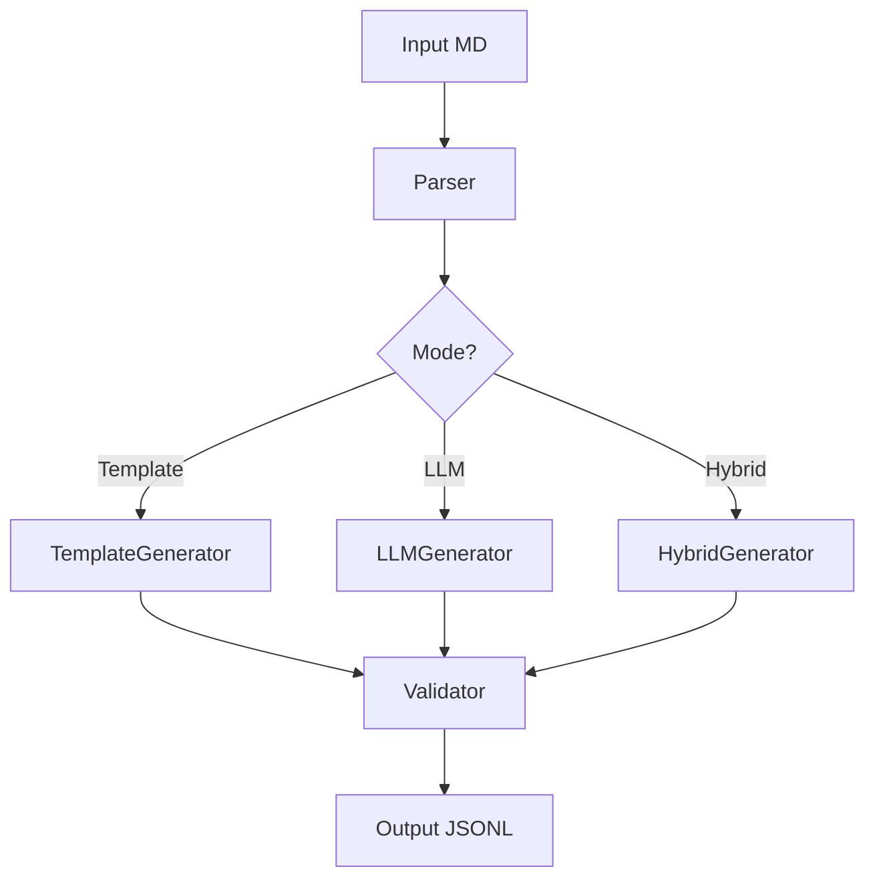

# Spécification: Commande `generate-questions`

**Version**: 1.0
**Date**: 2025-12-20
**Statut**: En développement

---

## 🎯 Objectif

Générer automatiquement des paires question/réponse depuis des documents Markdown structurés pour l'évaluation de systèmes RAG.

---

## 📋 Commande CLI

### Syntaxe
```bash
dyag generate-questions INPUT [OPTIONS]
```

### Arguments Positionnels

| Argument | Description | Type | Requis |
|----------|-------------|------|--------|
| `input` | Fichier Markdown source | Path | ✅ |

### Options

| Option | Description | Type | Défaut | Exemple |
|--------|-------------|------|--------|---------|
| `--output` | Fichier JSONL de sortie | Path | `{input}_questions.jsonl` | `questions.jsonl` |
| `--format` | Format de sortie | Choice | `rag` | `rag`, `finetuning`, `simple`, `all` |
| `--system-prompt` | Prompt système (format finetuning) | String | Auto | `"Tu es un assistant..."` |
| `--mode` | Mode de génération | Choice | `template` | `template`, `llm`, `hybrid` |
| `--questions-per-section` | Nombre de questions par section | Int | `3` | `5` |
| `--categories` | Catégories de questions | List | `all` | `status,domains,contacts` |
| `--provider` | Provider LLM (mode llm/hybrid) | Choice | `anthropic` | `anthropic`, `openai`, `ollama` |
| `--model` | Modèle LLM spécifique | String | Auto | `claude-3-5-sonnet-20241022` |
| `--difficulty` | Niveaux de difficulté | List | `easy,medium` | `easy`, `medium`, `hard` |
| `--language` | Langue des questions | String | `fr` | `fr`, `en` |
| `--include-metadata` | Inclure métadonnées dans output | Bool | `true` | - |
| `--validate` | Valider les questions générées | Bool | `true` | - |
| `--verbose` | Mode verbeux | Bool | `false` | - |

### Exemples

#### Mode Template (rapide, sans LLM)
```bash
dyag generate-questions examples/test-mygusi/applicationsIA_mini_1-10.md \
  --output evaluation/questions_10apps.jsonl \
  --mode template \
  --questions-per-section 3 \
  --categories status,domains,contacts,events \
  --verbose
```

#### Mode LLM (riche, nécessite API)
```bash
dyag generate-questions examples/test-mygusi/applicationsIA_mini_1-10.md \
  --output evaluation/questions_10apps_llm.jsonl \
  --mode llm \
  --provider anthropic \
  --model claude-3-5-sonnet-20241022 \
  --questions-per-section 5 \
  --difficulty easy,medium,hard \
  --verbose
```

#### Mode Hybride (meilleur équilibre)
```bash
dyag generate-questions examples/test-mygusi/applicationsIA_mini_1-10.md \
  --output evaluation/questions_10apps_hybrid.jsonl \
  --mode hybrid \
  --provider anthropic \
  --questions-per-section 4 \
  --verbose
```

---

## 🔧 Modes de Génération

### Mode 1: Template (Sans LLM)

**Avantages**:
- ✅ Rapide (pas d'appel API)
- ✅ Gratuit
- ✅ Reproductible à 100%
- ✅ Pas de dépendance externe

**Fonctionnement**:
1. Analyse la structure Markdown
2. Extrait les champs structurés
3. Applique des templates prédéfinis

**Templates Prédéfinis**:

```python
TEMPLATES = {
    "status": [
        "Quel est le statut de {app_name} ?",
        "L'application {app_name} est-elle en production ?",
        "Dans quel état se trouve {app_name} ?",
    ],
    "domains": [
        "Quels sont les domaines métier de {app_name} ?",
        "À quels domaines métier appartient {app_name} ?",
        "Dans quels domaines intervient {app_name} ?",
    ],
    "contacts": [
        "Qui est le contact principal pour {app_name} ?",
        "Comment contacter l'équipe de {app_name} ?",
        "Quels sont les contacts de {app_name} ?",
    ],
    "events": [
        "Quand {app_name} a-t-elle été mise en production ?",
        "Quelle est la date de création de {app_name} ?",
        "Quels sont les événements clés de {app_name} ?",
    ],
    "description": [
        "Quelle est la description de {app_name} ?",
        "À quoi sert {app_name} ?",
        "Quel est l'objectif de {app_name} ?",
    ],
    "websites": [
        "Quel est le site web de {app_name} ?",
        "Où trouver {app_name} en ligne ?",
        "Quelle est l'URL de {app_name} ?",
    ],
    "related_apps": [
        "Quelles applications sont liées à {app_name} ?",
        "Avec quelles autres applications {app_name} interagit-elle ?",
    ],
    "transversal": [
        "Quelles applications sont en production ?",
        "Combien d'applications concernent la biodiversité ?",
        "Quelles applications ont été modifiées en 2023 ?",
    ]
}
```

**Extraction de Réponses**:
```python
# Parsing du markdown structuré
if line.startswith("**Statut:**"):
    answer = line.split(":", 1)[1].strip()

if line.startswith("## Domaines métier"):
    # Collecte des domaines jusqu'à la prochaine section
    domains = extract_list_items(section)
```

### Mode 2: LLM (Avec Intelligence Artificielle)

**Avantages**:
- ✅ Questions naturelles et variées
- ✅ Comprend le contexte
- ✅ Génère des questions complexes
- ✅ Adapte la difficulté

**Fonctionnement**:
1. Découpe le document par application
2. Pour chaque application, envoie au LLM avec prompt
3. Parse et valide les questions générées

**Prompt Template**:
```python
PROMPT_TEMPLATE = """Tu es un expert en génération de questions pour évaluer des systèmes RAG.

Voici les informations sur une application:

{app_content}

Génère {n_questions} questions de test avec leurs réponses attendues.

Catégories à couvrir: {categories}
Niveaux de difficulté: {difficulty_levels}

Format de sortie (JSON):
{{
  "questions": [
    {{
      "question": "Question formulée naturellement",
      "expected_answer": "Réponse précise extraite du texte",
      "category": "status|domains|contacts|events|description|other",
      "difficulty": "easy|medium|hard",
      "reasoning": "Pourquoi cette question est pertinente"
    }}
  ]
}}

Règles:
1. Questions naturelles (comme un humain poserait)
2. Réponses extraites exactement du texte
3. Varier les formulations
4. Mix de questions simples et complexes
5. Questions qui nécessitent de combiner plusieurs sections
"""
```

**Validation**:
- Vérifier que la réponse existe dans le texte source
- Vérifier la qualité de la formulation
- Détecter les doublons

### Mode 3: Hybride (Meilleur Équilibre)

**Fonctionnement**:
1. Génère 50% des questions avec templates (rapide, fiable)
2. Génère 50% des questions avec LLM (riche, varié)
3. Fusionne et déduplique

**Avantages**:
- ✅ Équilibre coût/qualité
- ✅ Garantit une base solide (templates)
- ✅ Ajoute de la richesse (LLM)

---

## 📦 Formats de Sortie

La commande supporte **4 formats de sortie** pour différents cas d'usage :

### Format 1: `rag` (Évaluation RAG)

**Usage**: Évaluer les performances d'un système RAG

**Caractéristiques**:
- Métadonnées riches pour l'analyse
- Chunks attendus pour validation
- Catégories et difficulté
- Traçabilité complète

**Format**:
```jsonl
{"id": "q001", "question": "Quel est le statut de 6Tzen ?", "expected_answer": "En production", "category": "status", "difficulty": "easy", "app_name": "6Tzen", "app_id": "1238", "source_section": "metadata", "expected_chunks": ["chunk_6tzen_001"], "generated_by": "template"}
```

**Utilisation**:
```bash
dyag generate-questions apps.md --format rag --output questions_rag.jsonl

# Puis évaluer
dyag evaluate-rag questions_rag.jsonl --collection my_rag_db
```

### Format 2: `finetuning` (Fine-tuning LLM)

**Usage**: Entraîner un modèle sur des données spécifiques

**Caractéristiques**:
- Format OpenAI / Anthropic compatible
- Messages avec rôles (system, user, assistant)
- Optimisé pour fine-tuning
- Prompt système personnalisable

**Format (Style OpenAI/Anthropic)**:
```jsonl
{"messages": [{"role": "system", "content": "Tu es un assistant expert sur les applications du ministère de la transition écologique. Réponds de manière précise et factuelle."}, {"role": "user", "content": "Quel est le statut de 6Tzen ?"}, {"role": "assistant", "content": "L'application 6Tzen est actuellement en production. Elle a été mise en production le 10/02/2020 et sert à la dématérialisation des démarches des transports routiers."}]}
{"messages": [{"role": "system", "content": "Tu es un assistant expert sur les applications du ministère de la transition écologique. Réponds de manière précise et factuelle."}, {"role": "user", "content": "Quels sont les domaines métier de 6Tzen ?"}, {"role": "assistant", "content": "6Tzen intervient dans le domaine des Transports routiers. Plus spécifiquement, il s'agit de la dématérialisation des procédures administratives du registre des entreprises de transport par route."}]}
```

**Utilisation**:
```bash
# Générer dataset fine-tuning
dyag generate-questions apps.md \
  --format finetuning \
  --output dataset_finetuning.jsonl \
  --system-prompt "Tu es un expert des applications ministérielles."

# Fine-tuner avec OpenAI
openai api fine_tunes.create \
  -t dataset_finetuning.jsonl \
  -m gpt-3.5-turbo

# Fine-tuner avec Anthropic (à venir)
anthropic fine-tune create \
  --training-data dataset_finetuning.jsonl \
  --model claude-3-haiku
```

**Prompt Système par Défaut**:
```
Tu es un assistant expert sur les applications du ministère de la transition écologique et solidaire.
Tu réponds de manière précise, factuelle et concise aux questions sur les applications,
leurs caractéristiques, leurs domaines d'intervention et leurs contacts.
Tes réponses sont basées uniquement sur les informations documentées.
```

### Format 3: `simple` (Prompt/Completion)

**Usage**: Fine-tuning de modèles simples ou anciens

**Caractéristiques**:
- Format minimaliste
- Compatible modèles legacy
- Clé "prompt" / "completion"

**Format**:
```jsonl
{"prompt": "Quel est le statut de 6Tzen ?", "completion": "En production"}
{"prompt": "Quels sont les domaines métier de 6Tzen ?", "completion": "Transports routiers"}
```

**Utilisation**:
```bash
dyag generate-questions apps.md --format simple --output dataset_simple.jsonl

# Fine-tuning avec format simple
openai api fine_tunes.create \
  -t dataset_simple.jsonl \
  -m davinci
```

### Format 4: `all` (Tous les formats)

**Usage**: Générer tous les formats en une seule commande

**Comportement**:
Crée 3 fichiers avec suffixes appropriés :
- `questions_rag.jsonl`
- `questions_finetuning.jsonl`
- `questions_simple.jsonl`

**Utilisation**:
```bash
dyag generate-questions apps.md \
  --format all \
  --output questions

# Génère:
# - questions_rag.jsonl
# - questions_finetuning.jsonl
# - questions_simple.jsonl
```

---

## 📊 Tableau Comparatif des Formats

| Format | RAG Eval | Fine-tuning | Métadonnées | Taille | Compatible |
|--------|----------|-------------|-------------|--------|------------|
| `rag` | ✅ | ❌ | ✅✅✅ | Grande | dyag evaluate-rag |
| `finetuning` | ❌ | ✅✅ | ⚠️ Minimales | Moyenne | OpenAI, Anthropic, Hugging Face |
| `simple` | ❌ | ✅ | ❌ | Petite | Legacy models |
| `all` | ✅ | ✅ | ✅ | Grande (x3) | Tous |

---

## 📄 Format de Sortie - Détails

### Structure
```jsonl
{"id": "q001", "question": "Quel est le statut de 6Tzen ?", "expected_answer": "En production", "category": "status", "difficulty": "easy", "app_name": "6Tzen", "app_id": "1238", "source_section": "metadata", "generated_by": "template"}
{"id": "q002", "question": "Quels domaines métier couvre 6Tzen ?", "expected_answer": "Transports routiers", "category": "domains", "difficulty": "easy", "app_name": "6Tzen", "app_id": "1238", "source_section": "domaines_metier", "generated_by": "template"}
{"id": "q003", "question": "Pourquoi 6Tzen a-t-elle été créée et quels sont ses avantages pour l'usager ?", "expected_answer": "6Tzen a été créée dans le cadre du programme gouvernemental de simplification. Les avantages incluent: gain de temps, suivi simplifié, instruction facilitée, et diminution des délais de traitement.", "category": "description", "difficulty": "medium", "app_name": "6Tzen", "app_id": "1238", "source_section": "description", "generated_by": "llm"}
```

### Champs Obligatoires

| Champ | Type | Description | Exemple |
|-------|------|-------------|---------|
| `id` | String | Identifiant unique | `"q001"` |
| `question` | String | Question formulée | `"Quel est le statut ?"` |
| `expected_answer` | String | Réponse attendue | `"En production"` |
| `category` | String | Catégorie de question | `"status"` |
| `difficulty` | String | Niveau de difficulté | `"easy"` |

### Champs Optionnels

| Champ | Type | Description | Exemple |
|-------|------|-------------|---------|
| `app_name` | String | Nom de l'application | `"6Tzen"` |
| `app_id` | String | ID de l'application | `"1238"` |
| `source_section` | String | Section source | `"metadata"` |
| `generated_by` | String | Mode de génération | `"template"` / `"llm"` |
| `reasoning` | String | Justification (LLM) | `"Teste la compréhension..."` |
| `expected_chunks` | List | IDs chunks attendus | `["chunk_001"]` |
| `metadata` | Object | Métadonnées diverses | `{}` |

---

## 🏗️ Architecture d'Implémentation

### Structure de Fichiers

```
src/dyag/commands/
├── generate_questions.py       # Commande CLI principale
└── question_generators/
    ├── __init__.py
    ├── base.py                 # Classe abstraite BaseGenerator
    ├── template_generator.py   # Mode template
    ├── llm_generator.py        # Mode LLM
    ├── hybrid_generator.py     # Mode hybride
    ├── parser.py               # Parsing Markdown structuré
    ├── validator.py            # Validation des questions
    └── templates.py            # Templates de questions
```

### Classes Principales

```python
# base.py
class BaseQuestionGenerator(ABC):
    @abstractmethod
    def generate(self, content: dict) -> List[Question]:
        pass

    def validate(self, questions: List[Question]) -> List[Question]:
        pass

# template_generator.py
class TemplateQuestionGenerator(BaseQuestionGenerator):
    def __init__(self, templates: dict, categories: List[str]):
        self.templates = templates
        self.categories = categories

    def generate(self, content: dict) -> List[Question]:
        questions = []
        for category in self.categories:
            if category in content:
                questions.extend(
                    self._generate_from_template(category, content[category])
                )
        return questions

# llm_generator.py
class LLMQuestionGenerator(BaseQuestionGenerator):
    def __init__(self, provider: str, model: str):
        self.llm = create_llm_provider(provider, model)

    def generate(self, content: dict) -> List[Question]:
        prompt = self._build_prompt(content)
        response = self.llm.complete(prompt)
        questions = self._parse_response(response)
        return questions

# parser.py
class MarkdownParser:
    def parse_application(self, markdown: str) -> dict:
        """Extrait les infos structurées d'une application"""
        pass

    def extract_applications(self, markdown: str) -> List[dict]:
        """Extrait toutes les applications du document"""
        pass
```

### Flux d'Exécution



---

## 🔌 Intégration MCP

### Déclaration de l'Outil

```python
# src/dyag/mcp_server.py

@mcp.tool()
async def generate_questions(
    input_file: str,
    output_file: str | None = None,
    mode: Literal["template", "llm", "hybrid"] = "template",
    questions_per_section: int = 3,
    categories: list[str] | None = None,
    provider: str = "anthropic",
    model: str | None = None,
    difficulty: list[str] | None = None,
) -> dict:
    """
    Génère des paires question/réponse pour l'évaluation RAG

    Args:
        input_file: Fichier Markdown source
        output_file: Fichier JSONL de sortie (optionnel)
        mode: Mode de génération (template/llm/hybrid)
        questions_per_section: Nombre de questions par section
        categories: Catégories à générer (None = toutes)
        provider: Provider LLM (anthropic/openai/ollama)
        model: Modèle LLM spécifique
        difficulty: Niveaux de difficulté

    Returns:
        dict: {
            "questions_generated": int,
            "output_file": str,
            "mode": str,
            "summary": dict
        }
    """
    from dyag.commands.generate_questions import generate_questions_from_markdown

    result = generate_questions_from_markdown(
        input_path=input_file,
        output_path=output_file,
        mode=mode,
        questions_per_section=questions_per_section,
        categories=categories or ["all"],
        provider=provider,
        model=model,
        difficulty=difficulty or ["easy", "medium"],
        verbose=False
    )

    return result
```

---

## ✅ Critères de Validation

### Validation des Questions

1. **Syntaxe**:
   - Question se termine par `?`
   - Longueur > 10 caractères
   - Pas de caractères spéciaux invalides

2. **Sémantique**:
   - La réponse existe dans le texte source
   - La question est pertinente pour la catégorie
   - Pas de questions ambiguës

3. **Qualité** (mode LLM):
   - Formulation naturelle
   - Pas de répétitions
   - Diversité des formulations

### Métriques de Qualité

```python
quality_metrics = {
    "total_questions": 100,
    "valid_questions": 98,
    "invalid_questions": 2,
    "by_category": {
        "status": 15,
        "domains": 12,
        "contacts": 10,
        # ...
    },
    "by_difficulty": {
        "easy": 50,
        "medium": 30,
        "hard": 20
    },
    "by_generator": {
        "template": 60,
        "llm": 40
    }
}
```

---

## 🧪 Tests

### Tests Unitaires

```python
# tests/unit/commands/test_generate_questions.py

def test_template_generator_basic():
    """Test génération basique avec templates"""
    generator = TemplateQuestionGenerator(templates, ["status"])
    content = {"status": "En production", "app_name": "6Tzen"}
    questions = generator.generate(content)
    assert len(questions) > 0
    assert "6Tzen" in questions[0].question

def test_llm_generator_with_mock():
    """Test génération LLM avec mock"""
    mock_llm = MockLLMProvider()
    generator = LLMQuestionGenerator(mock_llm)
    content = {"description": "...", "app_name": "Test"}
    questions = generator.generate(content)
    assert len(questions) > 0

def test_validator():
    """Test validation des questions"""
    validator = QuestionValidator()
    valid_q = Question("Quel est le statut ?", "En production")
    invalid_q = Question("Test", "")  # Pas de ?

    assert validator.validate(valid_q) == True
    assert validator.validate(invalid_q) == False
```

### Tests d'Intégration

```bash
# Test end-to-end
python -m dyag generate-questions \
  examples/test-mygusi/applicationsIA_mini_1-10.md \
  --output /tmp/test_questions.jsonl \
  --mode template \
  --verbose

# Vérifier output
python -m pytest tests/integration/test_generate_questions.py
```

---

## 📚 Documentation

### README Section

````markdown
### Génération de Questions pour RAG

Générez automatiquement des questions/réponses pour évaluer votre système RAG.

#### Utilisation de Base

```bash
# Mode template (rapide, sans API)
dyag generate-questions document.md --mode template

# Mode LLM (riche, nécessite API)
dyag generate-questions document.md --mode llm --provider anthropic

# Mode hybride (recommandé)
dyag generate-questions document.md --mode hybrid
```

#### Exemples

```bash
# Générer 5 questions par section, toutes catégories
dyag generate-questions apps.md \
  --output questions.jsonl \
  --questions-per-section 5

# Seulement status et domains, difficulté facile
dyag generate-questions apps.md \
  --categories status,domains \
  --difficulty easy

# Avec Claude pour génération avancée
dyag generate-questions apps.md \
  --mode llm \
  --provider anthropic \
  --model claude-3-5-sonnet-20241022
```
````

---

## 🚀 Prochaines Étapes

1. ✅ Spécification écrite
2. ⏳ Implémentation:
   - `parser.py` - Parsing Markdown
   - `template_generator.py` - Mode template
   - `llm_generator.py` - Mode LLM
   - `hybrid_generator.py` - Mode hybride
   - `validator.py` - Validation
   - `generate_questions.py` - CLI command
3. ⏳ Tests unitaires
4. ⏳ Intégration MCP
5. ⏳ Documentation
6. ⏳ Tests sur applicationsIA_mini_1-10.md

---

**Version**: 1.0
**Auteur**: Claude Code
**Projet**: DYAG v0.8.0
