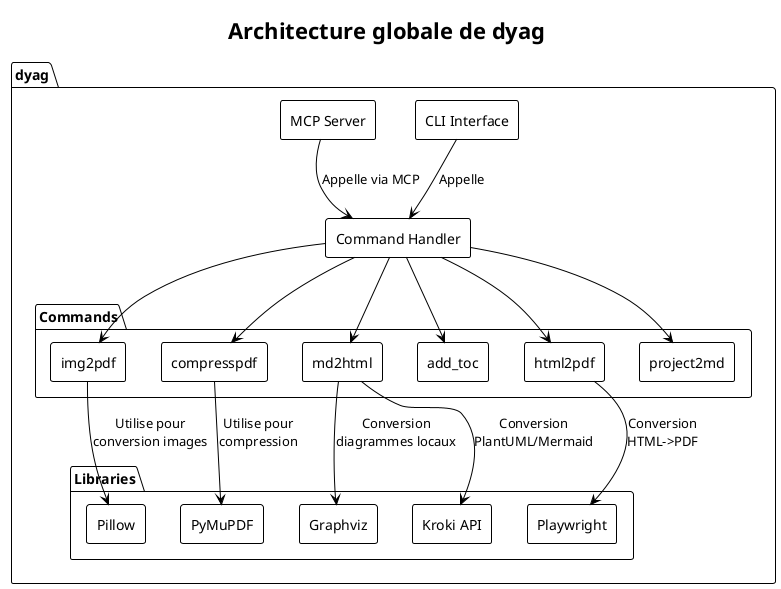
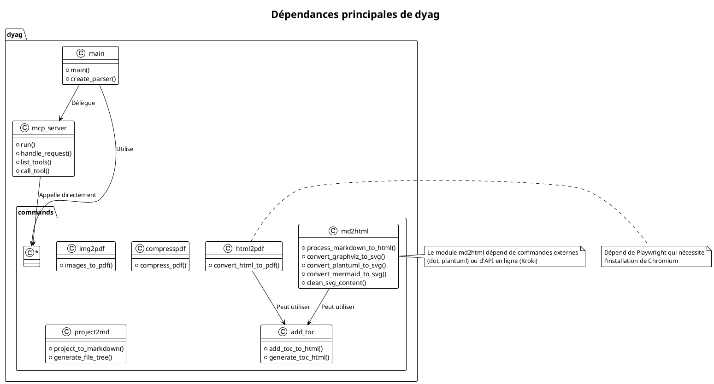
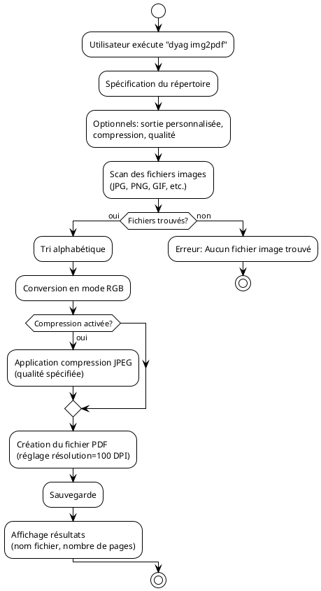
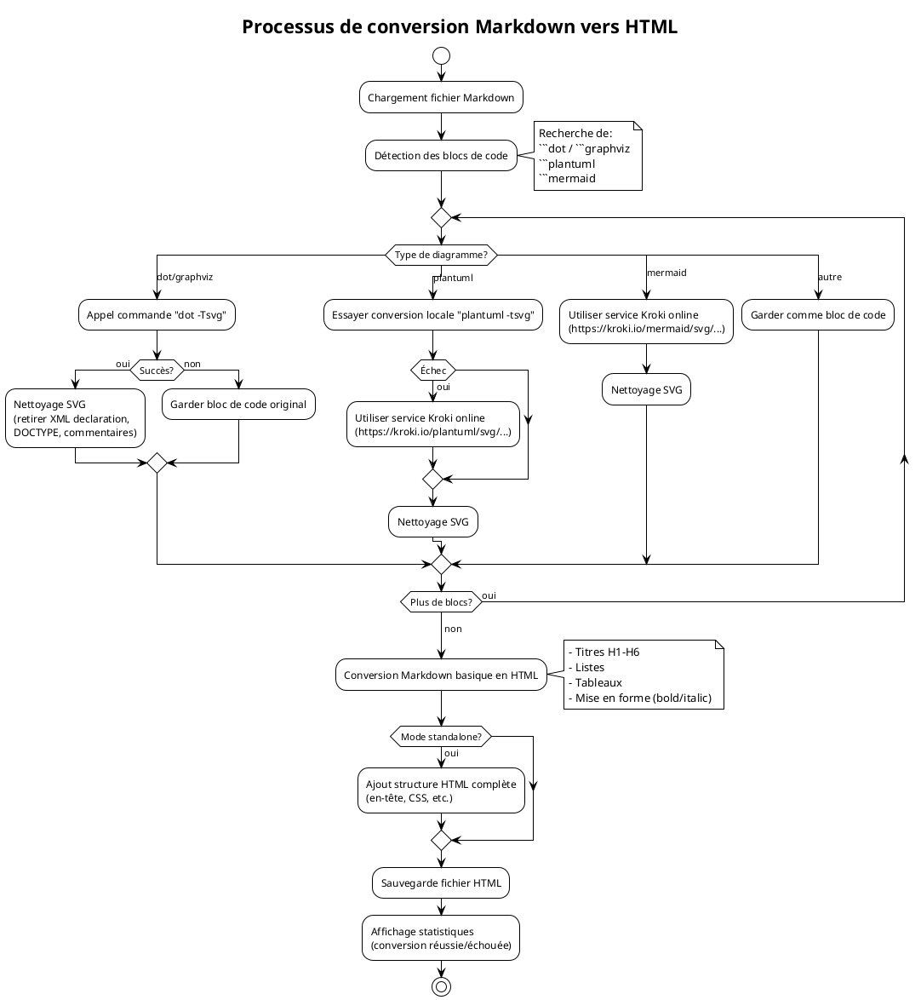
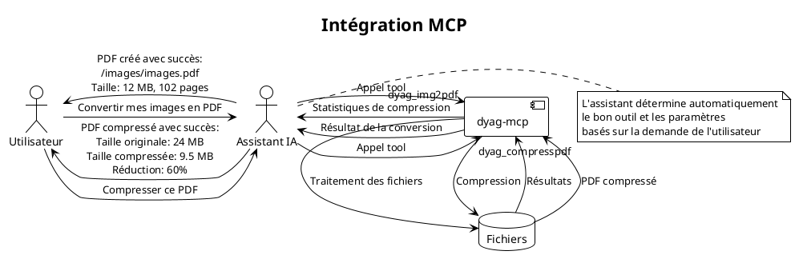
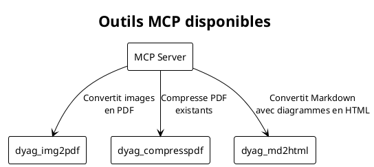
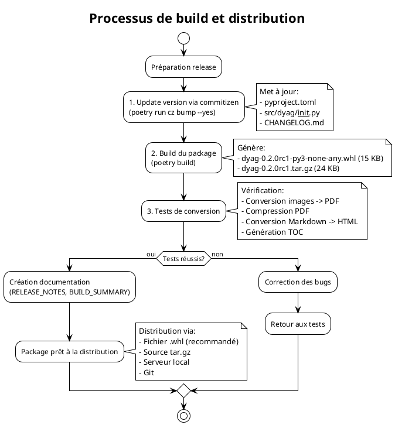
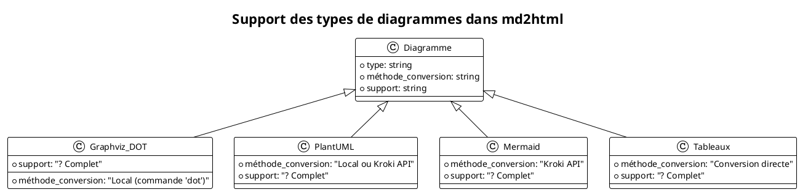
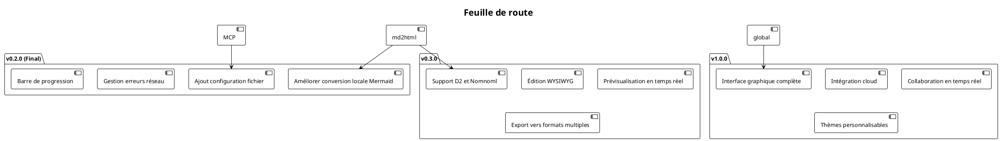

# Analyse détaillée de l'application dyag

## ?? Vue d'ensemble

`dyag` est une application CLI (Command Line Interface) Python conçue pour la manipulation de fichiers et la conversion entre différents formats. Le nom semble être un acronyme ou un jeu de mots basé sur les fonctionnalités principales de l'application.

**Version courante** : v0.2.0-rc.1 (Release Candidate 1)  
**Compatibilité** : Python 3.8+  
**Type** : Application de bureau avec intégration MCP (Model Context Protocol) pour assistants IA

Voici un diagramme donnant un aperçu global de l'architecture de l'application :



## ??? Structure technique du projet

### Organisation des fichiers

Le projet est organisé selon une structure standard pour une application Python :

```
?? dyag03/
+-- ?? doc/                       # Documentation technique
+-- ?? src/dyag/                  # Code source principal
¦   +-- ?? commands/              # Commandes CLI
¦   ¦   +-- add_toc.py            # Ajout de table des matières
¦   ¦   +-- compresspdf.py        # Compression de PDF
¦   ¦   +-- html2pdf.py           # Conversion HTML en PDF
¦   ¦   +-- img2pdf.py            # Conversion d'images en PDF
¦   ¦   +-- md2html.py            # Conversion Markdown en HTML
¦   ¦   +-- project2md.py         # Conversion projet en Markdown
¦   +-- __init__.py               # Version du package
¦   +-- __main__.py               # Entrée principale
¦   +-- main.py                   # Logique CLI principale
¦   +-- mcp_server.py             # Serveur MCP pour assistants IA
+-- ?? pyproject.toml             # Configuration du projet (Poetry)
+-- ?? poetry.lock                # Dépendances verrouillées
+-- ?? README.md                  # Documentation utilisateur
+-- ?? ...                        # Scripts de build et tests
```

### Diagramme des dépendances



## ?? Fonctionnalités principales

### 1. Conversion d'images en PDF (`img2pdf`)

Cette fonctionnalité permet de convertir toutes les images d'un répertoire en un fichier PDF unique, avec l'option de compression pour réduire la taille du fichier final.



### 2. Compression de PDF (`compresspdf`)

Cette commande retraite les images d'un PDF existant pour réduire sa taille avec une qualité configurable.

```plantuml
@startuml
!theme plain
title Processus de compression PDF

participant Utilisateur
participant CLI
participant "Module compresspdf"
participant PyMuPDF
participant Pillow

Utilisateur -> CLI: dyag compresspdf input.pdf -q 70
CLI -> "Module compresspdf": Appel fonction compress_pdf()
"Module compresspdf" -> PyMuPDF: Ouverture PDF (fitz.open)
loop Pour chaque page
  PyMuPDF --> "Module compresspdf": get_pixmap()
  "Module compresspdf" -> Pillow: Conversion en image
  if Qualité spécifiée? then (oui)
    Pillow --> "Module compresspdf": Sauvegarde avec qualité=70
  else (non)
    Pillow --> "Module compresspdf": Sauvegarde avec qualité=85
  endif
  "Module compresspdf" -> PyMuPDF: Insertion image compressée
end
"Module compresspdf" -> PyMuPDF: Sauvegarde PDF compressé
PyMuPDF --> "Module compresspdf": Fichier sauvegardé
"Module compresspdf" --> CLI: Statistiques (taille avant/après)
CLI --> Utilisateur: Affichage résultats
@enduml
```

### 3. Conversion Markdown en HTML avec diagrammes (`md2html`)

Cette fonctionnalité centrale permet de convertir des fichiers Markdown contenant des diagrammes en HTML avec des SVG intégrés. Voici le flux détaillé :



### 4. Intégration MCP (Model Context Protocol)

L'application dispose d'un serveur MCP pour permettre aux assistants IA (comme Claude) d'utiliser les fonctionnalités de `dyag` directement depuis leurs conversations.



### Diagramme des outils MCP disponibles



## ?? Workflow de Build et Distribution



## ?? Statistiques et performances

### Couverture des fonctionnalités

```plantuml
@startuml
pie title Couverture des fonctionnalités
"Conversion Markdown->HTML" : 35
"Manipulation PDF" : 30
"Intégration IA (MCP)" : 20
"Génération de documentation" : 15
@enduml
```

### Support des types de diagrammes



## ?? Perspectives d'amélioration



## ?? Conclusion

`dyag` est une application polyvalente pour la manipulation de documents, avec un focus particulier sur la conversion entre formats et l'enrichissement des documents avec des diagrammes. Son architecture modulaire permet une maintenance facile et une évolution progressive.

Points forts notables :
- **Architecture modulaire** avec séparation claire des responsabilités
- **Intégration IA avancée** via le protocole MCP
- **Support étendu des diagrammes** (Graphviz, PlantUML, Mermaid)
- **Workflow de release professionnel** avec Commitizen et Poetry
- **Documentation complète** pour les utilisateurs et développeurs

Points d'amélioration :
- Dépendance à des services externes (Kroki API) pour certaines fonctionnalités
- Nécessite des commandes système supplémentaires (dot, plantuml) pour un fonctionnement complet
- Pas d'interface graphique pour le moment (CLI uniquement)

Cette application représente une excellente base pour un système de génération de documentation technique moderne, avec une intégration transparente avec les assistants IA qui devient de plus en plus importante dans les workflows de développement.