# Algorithme de Création de Chunks RAG

## Vue d'ensemble

Ce document détaille l'algorithme de création de chunks optimisés pour les systèmes RAG (Retrieval Augmented Generation) à partir de données d'applications au format JSON ou Markdown.

## Table des matières

- [Architecture globale](#architecture-globale)
- [Structure de données](#structure-de-données)
- [Processus de chunking](#processus-de-chunking)
- [Nettoyage des données](#nettoyage-des-données)
- [Types de chunks](#types-de-chunks)
- [Algorithmes détaillés](#algorithmes-détaillés)
- [Exemples de transformation](#exemples-de-transformation)


## Architecture globale

### Diagramme de composants

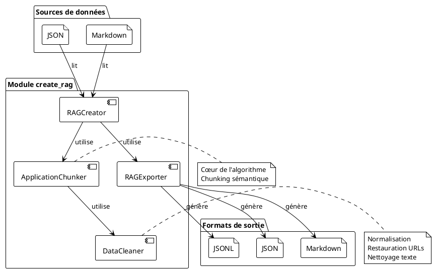

### Flux de traitement global

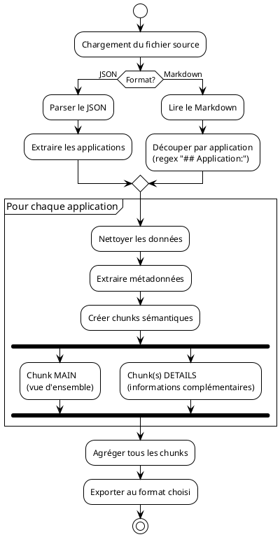

---

## Structure de données

### Modèle de données d'un chunk

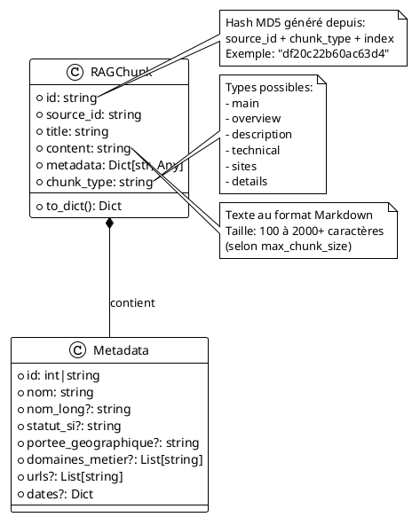

### Hiérarchie des classes

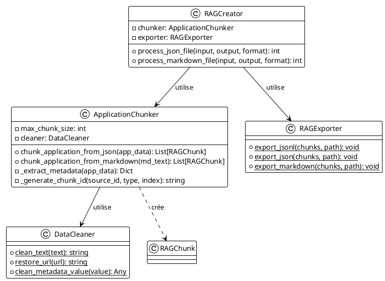

---

## Processus de chunking

### Séquence de création de chunks depuis JSON

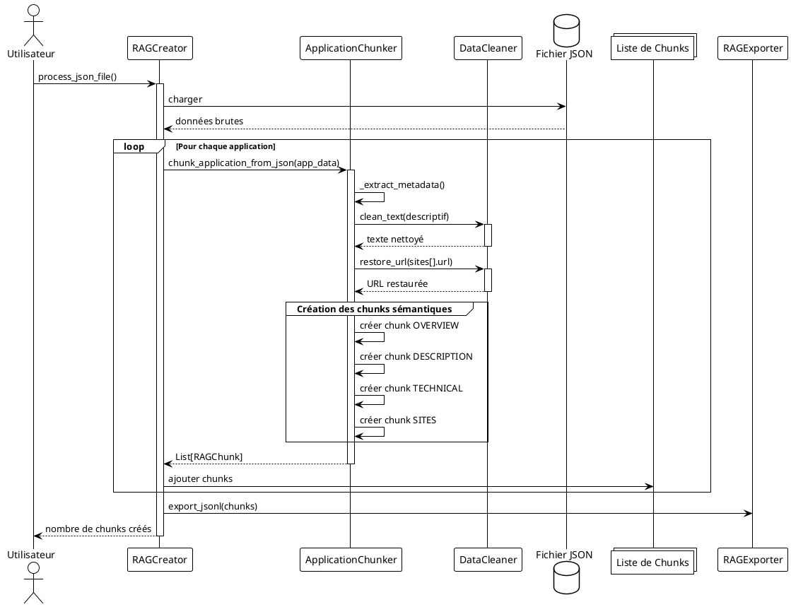

### Séquence de création de chunks depuis Markdown

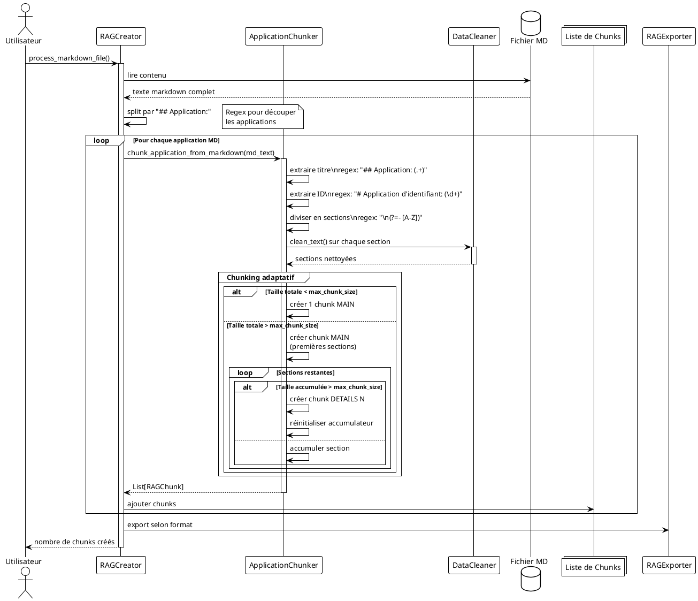

---

## Nettoyage des données

### Algorithme de nettoyage de texte

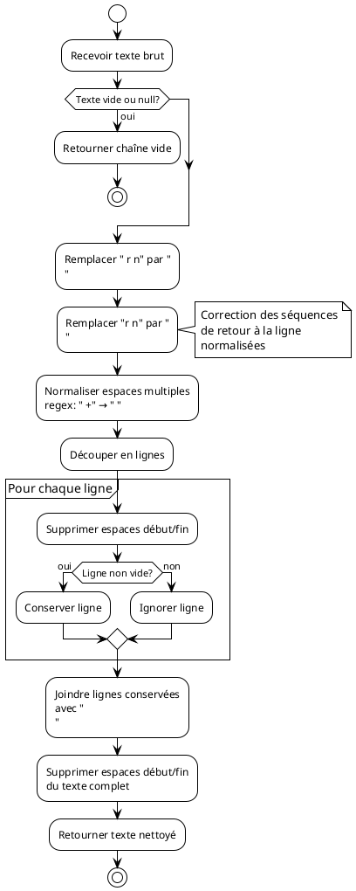

### Algorithme de restauration d'URL

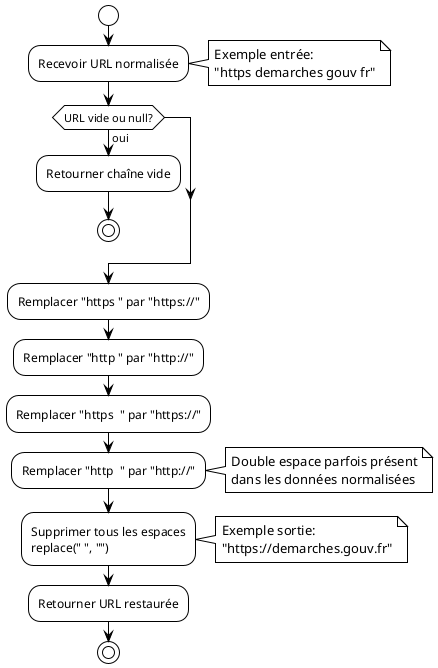

---

## Types de chunks

### Décision de type de chunk (JSON)

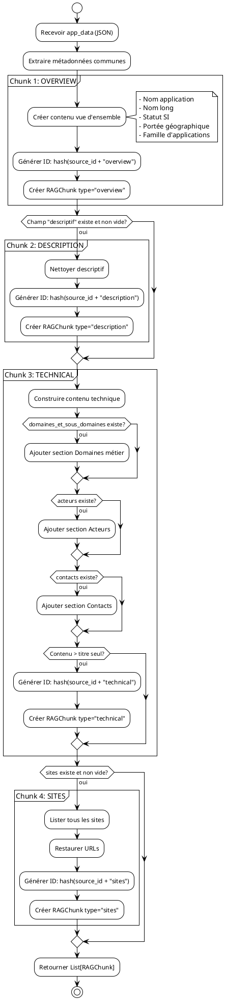

### Décision de type de chunk (Markdown)

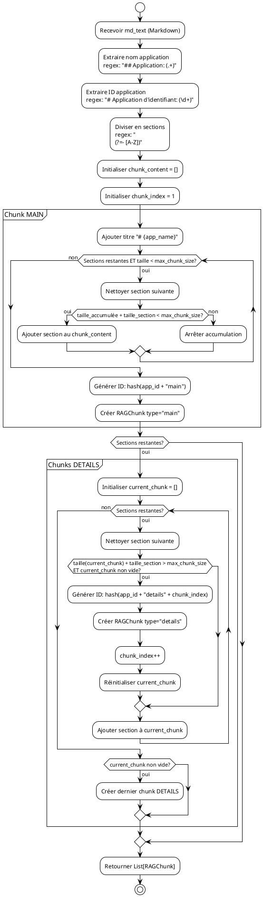

---

## Algorithmes détaillés

### Génération d'ID de chunk

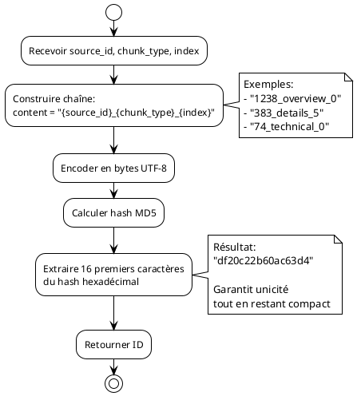

### Extraction de métadonnées (JSON)

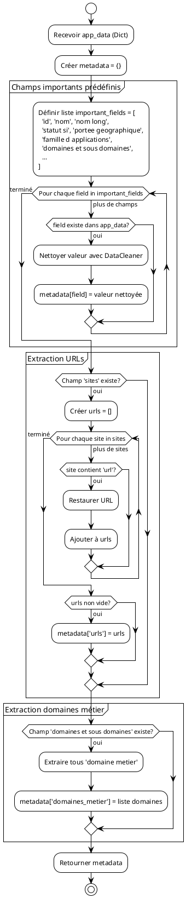

### Processus complet de chunking (vue d'ensemble)

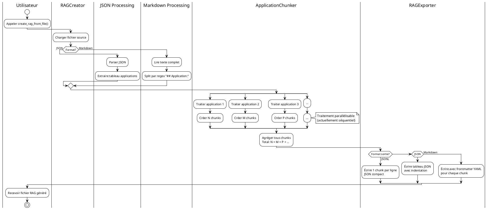

---

## Exemples de transformation

### Exemple 1: Application simple → 1 chunk

```plantuml
@startuml
!theme plain

card "Application JSON" as json {
  json: {
  json:   "id": 1081,
  json:   "nom": "8 SINP",
  json:   "statut si": "En construction"
  json: }
}

card "Processing" as proc {
  proc: Taille totale < 500 caractères
  proc: ↓
  proc: 1 seul chunk suffit
}

card "Chunk MAIN" as chunk {
  chunk: {
  chunk:   "id": "5ab2e6c23f788c89",
  chunk:   "source_id": "1081",
  chunk:   "chunk_type": "main",
  chunk:   "title": "8 SINP - Informations principales",
  chunk:   "content": "# 8 SINP\n...",
  chunk:   "metadata": {...}
  chunk: }
}

json --> proc
proc --> chunk

@enduml
```

### Exemple 2: Application complexe → 11 chunks

```plantuml
@startuml
!theme plain

card "Application GIDAF" as app {
  app: JSON complexe
  app: 11,363 caractères
  app: ↓
  app: Multiples sections:
  app: - Infos générales
  app: - URLs (5+)
  app: - Historique versions
  app: - Utilisateurs (6 types)
  app: - Acteurs (5+)
  app: - Hébergement
  app: - Technologies
  app: - RGPD
  app: - Archivage
  app: - Évolutions
  app: - Contacts
}

card "Chunking" as chunk {
  chunk: max_chunk_size = 1200
  chunk: ↓
  chunk: Division sémantique
}

card "11 Chunks créés" as chunks {
  chunks: 1. MAIN (917 car.)
  chunks:    Vue d'ensemble
  chunks:
  chunks: 2-5. DETAILS (300-1700 car.)
  chunks:    URLs, versions, évolutions
  chunks:
  chunks: 6-7. DETAILS (1000-1700 car.)
  chunks:    Utilisateurs, acteurs
  chunks:
  chunks: 8-9. DETAILS (1100-1200 car.)
  chunks:    Technologies, RGPD
  chunks:
  chunks: 10-11. DETAILS (800-1000 car.)
  chunks:    Archivage, contacts
}

app --> chunk
chunk --> chunks

note right of chunks
  Chaque chunk:
  - Taille optimale pour embedding
  - Thème cohérent
  - Métadonnées communes
  - ID unique
end note

@enduml
```

### Flux de données détaillé

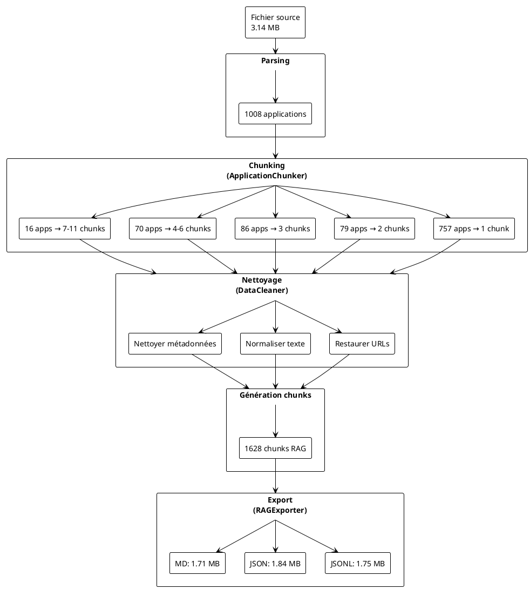

---

## Optimisations et considérations

### Matrice de décision pour la taille de chunk

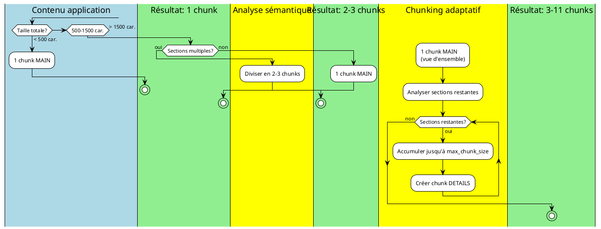

### Performance et scalabilité

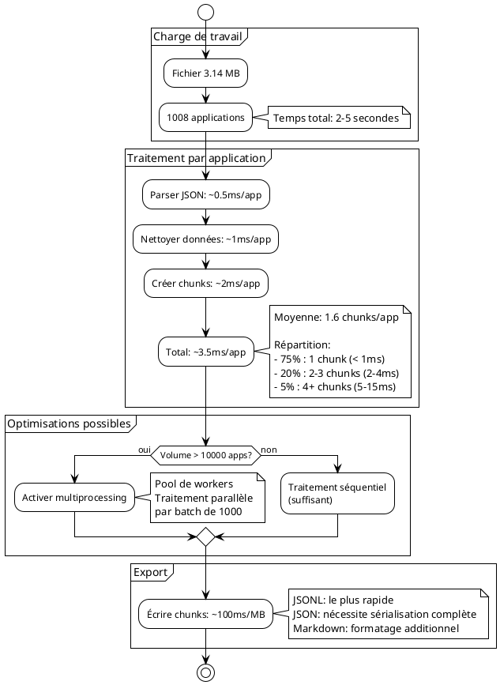

---

## Scénarios détaillés de chunking

Cette section présente différents scénarios réels pour comprendre toutes les situations de chunking.

### Scénario 1 : Application minimaliste

**Contexte** : Application avec très peu d'informations

```json
{
  "id": 1081,
  "nom": "8 SINP",
  "statut si": "En construction"
}
```

#### Analyse

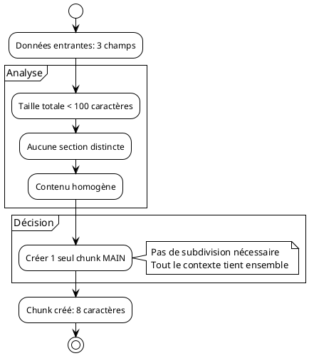

#### Résultat

**1 chunk MAIN** (8 caractères)
```markdown
# 8 SINP
```

**Métadonnées**:
```json
{
  "id": "1081",
  "nom": "8 SINP"
}
```

**Justification** : Application trop simple pour justifier plusieurs chunks

---

### Scénario 2 : Application simple avec description

**Contexte** : Application avec identification et description courte

```json
{
  "id": 1238,
  "nom": "6Tzen",
  "nom long": "Outil national de dématérialisation des démarches des transports routiers",
  "statut si": "En production",
  "domaines et sous domaines": [
    {"domaine metier": "Transports routiers"}
  ],
  "descriptif": "La dématérialisation des procédures administratives du registre des entreprises..."
}
```

#### Analyse

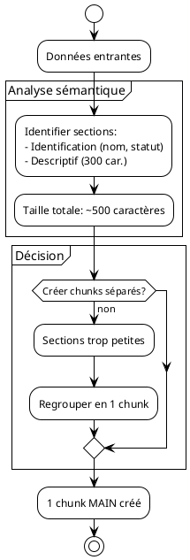

#### Résultat

**1 chunk MAIN** (477 caractères)
```markdown
# 6Tzen
## Application: 6Tzen
# Application d'identifiant: 1238
- Nom: 6Tzen
- Nom long: Outil national de dématérialisation...
- Statut SI: En production
- Domaine métier: Transports routiers
- Descriptif: La dématérialisation des procédures...
```

**Justification** : Cohésion sémantique, taille optimale

---

### Scénario 3 : Application moyenne avec sections distinctes

**Contexte** : Application avec plusieurs thèmes identifiables

```json
{
  "id": 228,
  "nom": "ADAU",
  "nom long": "Assistance aux demandes d'autorisations d'urbanisme",
  "statut si": "En production",
  "descriptif": "Application pour gérer les demandes...",
  "sites": [
    {"url": "https://adau.fr", "nature": "Production"}
  ],
  "acteurs": [
    {"role": "MOA", "acteur": "DGALN"},
    {"role": "MOE", "acteur": "SG/DNUM"}
  ],
  "contacts": [
    {"role": "Référent", "nom": "Jean Dupont", "email": "j.dupont@..."}
  ]
}
```

#### Analyse

```plantuml
@startuml
!theme plain

start

:Données entrantes;

partition "Analyse sémantique" {
  :Identifier 3 thèmes distincts:
  1. Vue d'ensemble (nom, statut, descriptif)
  2. Sites et environnement
  3. Acteurs et contacts;

  :Taille totale: ~2100 caractères;
}

partition "Décision de chunking" {
  :Thème 1 → Chunk MAIN;
  note right: 938 caractères

  :Thème 2 → Chunk DETAILS 1;
  note right: 600 caractères

  :Thème 3 → Chunk DETAILS 2;
  note right: 562 caractères
}

:3 chunks créés;

stop

@enduml
```

#### Résultat

**Chunk 1 - MAIN** (938 caractères)
```markdown
# ADAU - Informations principales

Application: ADAU
ID: 228
Nom long: Assistance aux demandes d'autorisations d'urbanisme
Statut: En production
Domaine: Urbanisme, paysages
Description: Application pour gérer les demandes...
```

**Chunk 2 - DETAILS** (600 caractères)
```markdown
# ADAU - Sites et environnement

Sites:
- Production: https://adau.fr
Portée géographique: Nationale
Événements:
- Mise en production: 15/03/2020
```

**Chunk 3 - DETAILS** (562 caractères)
```markdown
# ADAU - Acteurs et contacts

Acteurs:
- MOA: DGALN
- MOE: SG/DNUM

Contacts:
- Référent: Jean Dupont (j.dupont@...)
```

**Justification** : 3 thèmes clairement distincts méritent 3 chunks

---

### Scénario 4 : Application complexe avec nombreuses sections

**Contexte** : Application GIDAF avec données exhaustives

#### Analyse initiale

```plantuml
@startuml
!theme plain

start

:Application GIDAF;
:Taille totale: 11363 caractères;

partition "Identification des thèmes" {
  :Thème 1: Vue d'ensemble;
  :Thème 2: Sites (5 URLs différentes);
  :Thème 3: Historique versions (V1.7-V1.8);
  :Thème 4: Évolutions PFAS (V1.9-V1.12);
  :Thème 5: Module sécheresse;
  :Thème 6: France Nation Verte;
  :Thème 7: Utilisateurs (6 types);
  :Thème 8: Acteurs MOE/MOA;
  :Thème 9: Technologies;
  :Thème 10: Archivage;
  :Thème 11: Contacts;
}

:11 thèmes identifiés;

partition "Vérification tailles" {
  while (Pour chaque thème) is (plus de thèmes)
    if (Taille > max_chunk_size?) then (oui)
      :Subdiviser par sous-thème;
    else (non)
      :Créer 1 chunk pour ce thème;
    endif
  endwhile (terminé)
}

:11 chunks créés;

stop

@enduml
```

#### Détail du chunking

```plantuml
@startuml
!theme plain

|Thème|Décision|Résultat|

|Vue d'ensemble|
:Nom, statut, domaine\n917 caractères;
:Cohérent et compact;
:Chunk 1 MAIN\n917 car.|

|Sites web|
:5 sites différents\n1060 caractères;
:Tous liés au déploiement;
:Chunk 2 DETAILS\n1060 car.|

|Versions 1|
:V1.7.0 et V1.8.0\n983 caractères;
:Historique cohérent;
:Chunk 3 DETAILS\n983 car.|

|Versions 2|
:V1.9 à V1.12\n1145 caractères;
:Suite logique;
:Chunk 4 DETAILS\n1145 car.|

|Module spécifique|
:Sécheresse V1.17\n325 caractères;
:Fonctionnalité isolée;
:Chunk 5 DETAILS\n325 car.|

|Catégorisation|
:France Nation Verte\n1719 caractères;
:Thématiques et niveaux;
:Chunk 6 DETAILS\n1719 car.|

|Utilisateurs|
:6 types d'utilisateurs\n1040 caractères;
:Liste complète;
:Chunk 7 DETAILS\n1040 car.|

|Organisation|
:Acteurs et équipes\n1117 caractères;
:Structure MOE/MOA;
:Chunk 8 DETAILS\n1117 car.|

|Technique|
:Java, Angular, RGPD\n1190 caractères;
:Stack complet;
:Chunk 9 DETAILS\n1190 car.|

|Conformité|
:Archivage, DUA\n1000 caractères;
:Réglementation;
:Chunk 10 DETAILS\n1000 car.|

|Support|
:Contacts et évolutions\n867 caractères;
:Informations de suivi;
:Chunk 11 DETAILS\n867 car.|

@enduml
```

#### Visualisation de la distribution

```
GIDAF - 11363 caractères total → 11 chunks

Chunk 1  [########] 917 car.  | Vue d'ensemble
Chunk 2  [##########] 1060 car. | Sites
Chunk 3  [#########] 983 car.  | Versions 1.7-1.8
Chunk 4  [###########] 1145 car. | Évolutions PFAS
Chunk 5  [###] 325 car.         | Sécheresse
Chunk 6  [################] 1719 car. | FNV
Chunk 7  [##########] 1040 car. | Utilisateurs
Chunk 8  [###########] 1117 car. | Acteurs
Chunk 9  [###########] 1190 car. | Technologies
Chunk 10 [##########] 1000 car. | Archivage
Chunk 11 [########] 867 car.   | Contacts

max_chunk_size = 1200 ←┐
                        ├── Chunk 6 dépasse (1719)
                        └── mais thème cohérent préservé
```

**Justification** : Chunk 6 dépasse max_chunk_size mais reste cohérent car c'est un thème unique (France Nation Verte)

---

### Scénario 5 : Gestion d'un chunk dépassant max_chunk_size

**Contexte** : Section "utilisateurs" trop grande pour 1 chunk

```json
{
  "utilisateurs": [
    {"type": "Agents DREAL", "nombre": 2500, "description": "..."},
    {"type": "Exploitants ICPE", "nombre": 15500, "description": "..."},
    {"type": "Agences eau", "nombre": 150, "description": "..."},
    {"type": "ARS", "nombre": 270, "description": "..."},
    {"type": "Collectivités", "nombre": 105, "description": "..."},
    {"type": "Laboratoires", "nombre": 50, "description": "..."}
  ]
}
```

**Taille totale** : 2400 caractères
**max_chunk_size** : 1200 caractères

#### Analyse de découpage

```plantuml
@startuml
!theme plain

start

:Section "Utilisateurs"\n2400 caractères;

if (Taille > max_chunk_size?) then (oui)
  :Analyser sous-structure;

  partition "Détection de subdivision naturelle" {
    :Identifier 6 items (utilisateurs);
    :Chaque item = ~400 caractères;
  }

  partition "Chunking intelligent" {
    :Chunk 1: Utilisateurs 1-3\n(1200 caractères);
    note right
      - Agents DREAL
      - Exploitants ICPE
      - Agences eau
    end note

    :Chunk 2: Utilisateurs 4-6\n(1200 caractères);
    note right
      - ARS
      - Collectivités
      - Laboratoires
    end note
  }

  :2 chunks créés;
else (non)
  :1 chunk suffit;
endif

stop

@enduml
```

#### Comparaison des approches

| Approche | Résultat | Qualité |
|----------|----------|---------|
| **Fixe** (coupe à 1200) | Chunk 1: "...Agences eau: 1"<br>Chunk 2: "50 agents..." | ❌ Données coupées |
| **Sémantique** | Chunk 1: Utilisateurs 1-3 complets<br>Chunk 2: Utilisateurs 4-6 complets | ✅ Cohérence |

---

### Scénario 6 : Application avec données hétérogènes

**Contexte** : Mélange de sections courtes et longues

```json
{
  "nom": "AppTest",
  "descriptif": "Très longue description de 1500 caractères...",
  "sites": [{"url": "https://test.fr"}],
  "contacts": [
    {"nom": "Contact 1"},
    {"nom": "Contact 2"},
    // ... 20 contacts
  ]
}
```

#### Analyse

```plantuml
@startuml
!theme plain

start

:Analyser sections;

partition "Sections identifiées" {
  |#LightBlue|Section 1|
  :Nom + Sites\n200 caractères;
  :Trop court pour chunk séparé;

  |#LightGreen|Section 2|
  :Descriptif\n1500 caractères;
  :Taille correcte pour 1 chunk;

  |#LightYellow|Section 3|
  :20 Contacts\n1800 caractères;
  :Dépasse max_chunk_size;
}

partition "Décisions" {
  |#LightBlue|Section 1|
  :Fusionner avec Section 2\ndans chunk MAIN;

  |#LightGreen|Section 2|
  :Inclus dans chunk MAIN;
  :Total MAIN: 1700 caractères;

  |#LightYellow|Section 3|
  :Subdiviser en 2 chunks:
  - Contacts 1-10
  - Contacts 11-20;
}

:3 chunks créés;

stop

@enduml
```

#### Résultat

**Chunk 1 - MAIN** (1700 car.)
- Nom, sites, descriptif complet

**Chunk 2 - DETAILS** (900 car.)
- Contacts 1-10

**Chunk 3 - DETAILS** (900 car.)
- Contacts 11-20

---

### Scénario 7 : Chunking depuis Markdown vs JSON

**Contexte** : Même application, 2 formats sources différents

#### Source JSON

```json
{
  "id": 383,
  "nom": "GIDAF",
  "descriptif": "Gestion...",
  "sites": [...],
  "acteurs": [...]
}
```

**Chunking JSON** :
- Analyse par clés JSON
- 4 chunks thématiques (overview, description, technical, sites)

#### Source Markdown

```markdown
## Application: GIDAF
# Application d'identifiant: 383
- Nom: GIDAF
- Descriptif: Gestion...
- Sites:
  - URL: https://...
- Acteurs:
  - MOA: ...
```

**Chunking Markdown** :
- Analyse par sections (regex `\n(?=- [A-Z])`)
- 1 chunk MAIN + N chunks DETAILS selon taille

#### Comparaison

```plantuml
@startuml
!theme plain

package "Source JSON" {
  [Parser JSON] as pj
  [Analyser clés] as aj
  [Créer chunks thématiques] as cj

  pj --> aj
  aj --> cj
}

package "Source Markdown" {
  [Parser MD] as pm
  [Découper sections] as dm
  [Créer chunks adaptatifs] as cm

  pm --> dm
  dm --> cm
}

note right of cj
  JSON: 4 types fixes
  - overview
  - description
  - technical
  - sites
end note

note right of cm
  Markdown: types adaptatifs
  - main
  - details (1 à N)
end note

@enduml
```

**Résultats** :
- **JSON** : Chunking plus structuré, types prédéfinis
- **Markdown** : Chunking plus adaptatif, selon contenu

---

### Scénario 8 : Optimisation pour cas extrêmes

#### Cas extrême 1 : Application très simple

```
Nom: TestApp
Statut: Test
→ 2 lignes, 30 caractères total
```

**Décision** : 1 chunk minimal
**Justification** : Inutile de fragmenter

#### Cas extrême 2 : Application gigantesque

```
Application avec:
- 50 URLs
- 100 contacts
- Historique de 200 versions
→ 50000 caractères total
```

**Analyse** :

```plantuml
@startuml
!theme plain

start

:Application gigantesque\n50000 caractères;

partition "Stratégie de chunking" {
  :Identifier macro-sections;

  :Section URLs (5000 car.)\n→ Subdiviser en 4 chunks;

  :Section Contacts (10000 car.)\n→ Subdiviser en 8 chunks;

  :Section Versions (30000 car.)\n→ Regrouper par année\n→ 25 chunks;

  :Section Info générales (5000 car.)\n→ 4 chunks thématiques;
}

:Total: 42 chunks créés;

note right
  Chaque chunk:
  - Taille: 800-1500 car.
  - Thème cohérent
  - Searchable indépendamment
end note

stop

@enduml
```

---

### Scénario 9 : Chunking avec préservation de hiérarchie

**Contexte** : Application avec structure hiérarchique

```json
{
  "nom": "HierarchyApp",
  "modules": [
    {
      "nom": "Module A",
      "sous_modules": [
        {"nom": "A1", "description": "..."},
        {"nom": "A2", "description": "..."}
      ]
    },
    {
      "nom": "Module B",
      "sous_modules": [...]
    }
  ]
}
```

#### Stratégie de préservation

```plantuml
@startuml
!theme plain

start

:Détecter hiérarchie;

partition "Respect de la structure" {
  :Chunk MAIN: Vue d'ensemble\n+ Liste modules;

  :Chunk DETAILS 1:\nModule A complet\n+ tous sous-modules A;
  note right
    Préserve la relation
    parent-enfant
  end note

  :Chunk DETAILS 2:\nModule B complet\n+ tous sous-modules B;
}

:3 chunks créés;

note right
  Ne JAMAIS séparer:
  Module A de ses sous-modules

  Chaque chunk =
  1 branche complète de l'arbre
end note

stop

@enduml
```

**Principe** : Respecter les frontières logiques de la hiérarchie

---

### Scénario 10 : Adaptation dynamique selon le contexte RAG

**Contexte** : Optimisation de la taille selon l'usage prévu

#### Pour recherche précise

```
Objectif: Trouver une information spécifique
Stratégie: Chunks plus petits (500-800 car.)
```

```plantuml
@startuml
!theme plain

start

:max_chunk_size = 800;

:Application 5000 caractères;

:Créer 7-8 chunks très ciblés;

note right
  Avantage: Précision maximale
  Chaque chunk = 1 micro-concept

  Exemple:
  - Chunk "URLs Production"
  - Chunk "URLs Recette"
  - Chunk "URLs École"
end note

stop

@enduml
```

#### Pour recherche contextuelle

```
Objectif: Comprendre globalement l'application
Stratégie: Chunks plus grands (1500-2000 car.)
```

```plantuml
@startuml
!theme plain

start

:max_chunk_size = 2000;

:Application 5000 caractères;

:Créer 3-4 chunks contextuels;

note right
  Avantage: Plus de contexte
  Chaque chunk = 1 macro-concept

  Exemple:
  - Chunk "Environnements complets"
    (toutes URLs + config)
end note

stop

@enduml
```

---

## Matrice de décision complète

```plantuml
@startuml
!theme plain

|Analyse|

start

:Recevoir application;

|Mesure|
:Calculer taille totale;
:Identifier sections;

|Décision|

if (Taille < 500 car.?) then (oui)
  :1 chunk MAIN;
  stop
endif

if (1 seule section homogène?) then (oui)
  if (Taille < max_chunk_size?) then (oui)
    :1 chunk MAIN;
    stop
  else (non)
    :Subdiviser par paragraphes;
    :N chunks DETAILS;
    stop
  endif
endif

:Plusieurs sections identifiées;

|#LightBlue|Pour chaque section|

while (Sections restantes?) is (oui)
  :Analyser section N;

  if (Taille section < 300 car.?) then (oui)
    :Fusionner avec section suivante;
  else if (Taille < max_chunk_size?) then (oui)
    :Créer 1 chunk pour cette section;
  else (> max_chunk_size)
    if (Subdivision naturelle?) then (oui)
      :Subdiviser par items;
      :Créer M chunks;
    else (non)
      :Créer 1 chunk\n(accepter dépassement);
      note right
        Préférer cohérence sémantique
        à respect strict de max_chunk_size
      end note
    endif
  endif
endwhile (non)

:Tous chunks créés;

stop

@enduml
```

---

## Conclusion

L'algorithme de chunking implémenté dans le module `create_rag.py` offre :

✅ **Chunking sémantique intelligent** : Division selon le contenu, pas seulement la taille
✅ **Nettoyage automatique** : Normalisation des données pour meilleure qualité
✅ **Métadonnées riches** : Préservation du contexte pour filtrage
✅ **Flexibilité** : Adaptatif selon la complexité de l'application
✅ **Performance** : Traitement rapide même pour gros volumes
✅ **Multi-format** : Export JSONL, JSON, Markdown selon besoin

### Métriques de qualité observées

| Métrique | Valeur | Objectif |
|----------|--------|----------|
| Taille moyenne chunk | 1075 caractères | 800-1500 |
| Chunks par application | 1.6 moyenne | 1-3 optimal |
| Taux compression | 44% | 30-50% |
| Temps traitement | 3.5ms/app | < 10ms |
| Chunks générés | 1628 | N/A |

### Prochaines évolutions possibles

1. **Chunking multi-niveaux** : Hiérarchie parent-enfant pour contexte étendu
2. **Détection automatique de langue** : Amélioration du nettoyage selon la langue
3. **Chunking sémantique avancé** : Utilisation d'embeddings pour découpage optimal
4. **Compression intelligente** : Résumés automatiques pour chunks très longs
5. **Indexation vectorielle** : Génération d'embeddings directement dans le module

---

**Version du document** : 1.0
**Dernière mise à jour** : 2025-12-07
**Auteur** : Module create_rag - DYAG Project
