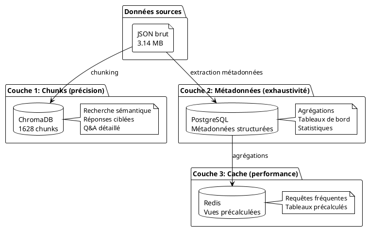

# Utiliser les chunks RAG pour le management et tableaux de bord

## Vue d'ensemble

**Question clé** : Peut-on obtenir des réponses **ciblées** ET **exhaustives** avec des fichiers chunkés pour créer des tableaux de suivi et de management ?

**Réponse** : **OUI**, en combinant chunking sémantique + agrégation intelligente + métadonnées structurées.

---

## Table des matières

- [Le défi : Précision vs Exhaustivité](#le-défi--précision-vs-exhaustivité)
- [Architecture hybride recommandée](#architecture-hybride-recommandée)
- [Stratégies d'agrégation](#stratégies-dagrégation)
- [Requêtes pour tableaux de bord](#requêtes-pour-tableaux-de-bord)
- [Exemples concrets de tableaux](#exemples-concrets-de-tableaux)
- [Implémentation pratique](#implémentation-pratique)

---

## Le défi : Précision vs Exhaustivité

### Apparente contradiction

```plantuml
@startuml
!theme plain

card "Besoin 1: Réponses ciblées" as need1 {
  need1: Question: "Qui héberge GIDAF ?"
  need1: → Besoin: 1 chunk précis
  need1: → Résultat: "BRGM"
}

card "Besoin 2: Vues exhaustives" as need2 {
  need2: Question: "Tous les hébergeurs utilisés"
  need2: → Besoin: TOUS les chunks
  need2: → Résultat: Liste complète
}

note bottom of need1
  Chunking = excellent
  pour précision
end note

note bottom of need2
  Chunking = comment avoir
  la vue complète ?
end note

@enduml
```

### La solution : Architecture hybride

**Principe** : Combiner chunks (pour précision) + métadonnées (pour exhaustivité)


```plantuml
@startuml
!theme plain

package "Données sources" {
  file "JSON brut\n3.14 MB" as source
}

package "Couche 1: Chunks (précision)" {
  database "ChromaDB\n1628 chunks" as chunks
  note right
    Recherche sémantique
    Réponses ciblées
    Q&A détaillé
  end note
}

package "Couche 2: Métadonnées (exhaustivité)" {
  database "PostgreSQL\nMétadonnées structurées" as meta
  note right
    Agrégations
    Tableaux de bord
    Statistiques
  end note
}

package "Couche 3: Cache (performance)" {
  database "Redis\nVues précalculées" as cache
  note right
    Requêtes fréquentes
    Tableaux précalculés
  end note
}

source --> chunks : chunking
source --> meta : extraction métadonnées
meta --> cache : agrégations

@enduml
```

---

## Architecture hybride recommandée

### Pourquoi une architecture hybride ?

| Besoin | Solution | Technologie |
|--------|----------|-------------|
| **Réponse ciblée** | "Quelle est la stack de GIDAF ?" | ChromaDB (chunks) |
| **Vue exhaustive** | "Liste de toutes les apps Java" | PostgreSQL (métadonnées) |
| **Tableau de bord** | "Répartition par domaine métier" | Redis (cache) + PostgreSQL |
| **Recherche sémantique** | "Apps pour la biodiversité" | ChromaDB (chunks) |
| **Reporting** | "Evolution mensuelles" | PostgreSQL (métadonnées) |

### Structure des métadonnées PostgreSQL

```sql
-- Table principale applications
CREATE TABLE applications (
    id INTEGER PRIMARY KEY,
    nom VARCHAR(255),
    nom_long TEXT,
    statut_si VARCHAR(50),
    portee_geographique VARCHAR(50),
    famille VARCHAR(255),
    date_creation TIMESTAMP,
    date_modification TIMESTAMP
);

-- Table domaines métiers
CREATE TABLE domaines (
    id SERIAL PRIMARY KEY,
    application_id INTEGER REFERENCES applications(id),
    domaine_metier VARCHAR(255),
    sous_domaine VARCHAR(255)
);

-- Table technologies
CREATE TABLE technologies (
    id SERIAL PRIMARY KEY,
    application_id INTEGER REFERENCES applications(id),
    technologie VARCHAR(100),
    version VARCHAR(50)
);

-- Table acteurs
CREATE TABLE acteurs (
    id SERIAL PRIMARY KEY,
    application_id INTEGER REFERENCES applications(id),
    role VARCHAR(100),
    nom_acteur VARCHAR(255)
);

-- Table utilisateurs
CREATE TABLE utilisateurs (
    id SERIAL PRIMARY KEY,
    application_id INTEGER REFERENCES applications(id),
    type_utilisateur VARCHAR(100),
    nombre INTEGER
);

-- Table pour lier chunks et métadonnées
CREATE TABLE chunks_metadata (
    chunk_id VARCHAR(50) PRIMARY KEY,
    application_id INTEGER REFERENCES applications(id),
    chunk_type VARCHAR(50),
    taille INTEGER
);
```

### Extraction automatique des métadonnées

```python
from dyag.commands.create_rag import RAGCreator
import psycopg2
import json

def extract_and_store_metadata(json_file, db_connection):
    """
    Extrait les métadonnées ET crée les chunks.

    Processus:
    1. Créer les chunks pour ChromaDB
    2. Extraire métadonnées pour PostgreSQL
    3. Créer les liens chunk_id <-> application_id
    """

    # 1. Créer les chunks
    creator = RAGCreator()
    chunks = []

    with open(json_file, 'r', encoding='utf-8') as f:
        data = json.load(f)
        applications = data.get('applicationsia mini', [])

    # 2. Pour chaque application
    for app_data in applications:
        app_id = app_data.get('id')

        # A. Créer chunks
        app_chunks = creator.chunker.chunk_application_from_json(app_data)
        chunks.extend(app_chunks)

        # B. Insérer métadonnées dans PostgreSQL
        cursor = db_connection.cursor()

        # Application principale
        cursor.execute("""
            INSERT INTO applications (id, nom, nom_long, statut_si, ...)
            VALUES (%s, %s, %s, %s, ...)
        """, (app_id, app_data.get('nom'), ...))

        # Domaines
        for domaine in app_data.get('domaines et sous domaines', []):
            cursor.execute("""
                INSERT INTO domaines (application_id, domaine_metier, sous_domaine)
                VALUES (%s, %s, %s)
            """, (app_id, domaine.get('domaine metier'), domaine.get('sous domaine metier')))

        # Technologies (extrait du descriptif)
        # ... extraction intelligente

        # C. Lier chunks à l'application
        for chunk in app_chunks:
            cursor.execute("""
                INSERT INTO chunks_metadata (chunk_id, application_id, chunk_type, taille)
                VALUES (%s, %s, %s, %s)
            """, (chunk.id, app_id, chunk.chunk_type, len(chunk.content)))

        db_connection.commit()

    return chunks
```

---

## Stratégies d'agrégation

### Stratégie 1 : Agrégation par métadonnées

**Pour** : Tableaux de bord, statistiques, vues d'ensemble

```python
# Exemple: Nombre d'applications par domaine métier
def get_apps_by_domain():
    query = """
        SELECT
            domaine_metier,
            COUNT(DISTINCT application_id) as nb_apps,
            STRING_AGG(DISTINCT a.nom, ', ') as liste_apps
        FROM domaines d
        JOIN applications a ON d.application_id = a.id
        GROUP BY domaine_metier
        ORDER BY nb_apps DESC
    """

    results = execute_query(query)

    # Résultat:
    # domaine_metier          | nb_apps | liste_apps
    # ------------------------|---------|------------------
    # Biodiversité           | 87      | SIB, SINP, ONB...
    # Urbanisme              | 156     | ADAU, ADS, ...
    # Transports routiers    | 45      | 6Tzen, ...

    return results
```

### Stratégie 2 : Agrégation par chunks

**Pour** : Analyse sémantique agrégée, tendances

```python
# Exemple: Technologies les plus utilisées (via chunks)
def get_technology_trends():
    # 1. Récupérer tous les chunks de type "technical"
    chunks = vector_db.get(where={"chunk_type": "technical"})

    # 2. Extraire technologies avec NER ou regex
    tech_counter = {}
    for chunk in chunks:
        technologies = extract_technologies(chunk.content)
        for tech in technologies:
            tech_counter[tech] = tech_counter.get(tech, 0) + 1

    # 3. Trier et retourner
    # Résultat:
    # Java: 234 mentions
    # PostgreSQL: 156 mentions
    # Angular: 89 mentions

    return sorted(tech_counter.items(), key=lambda x: x[1], reverse=True)
```

### Stratégie 3 : Agrégation hybride

**Pour** : Combinaison précision + exhaustivité

```python
# Exemple: Détail complet d'un domaine métier
def get_domain_complete_view(domain_name):
    # 1. Métadonnées (exhaustivité)
    meta_query = """
        SELECT a.id, a.nom, a.statut_si, a.portee_geographique
        FROM applications a
        JOIN domaines d ON a.id = d.application_id
        WHERE d.domaine_metier = %s
    """
    apps = execute_query(meta_query, (domain_name,))

    # 2. Pour chaque app, récupérer chunk principal (précision)
    detailed_apps = []
    for app in apps:
        # Recherche sémantique du chunk le plus pertinent
        chunk = vector_db.query(
            query_texts=[f"Description de {app['nom']}"],
            where={"source_id": str(app['id']), "chunk_type": "overview"},
            n_results=1
        )

        detailed_apps.append({
            "metadata": app,  # Données structurées
            "description": chunk  # Contenu riche
        })

    return {
        "domain": domain_name,
        "total_apps": len(apps),
        "applications": detailed_apps
    }
```

---

## Requêtes pour tableaux de bord

### Tableau 1 : Vue d'ensemble du portefeuille

**Besoin** : KPIs principaux

```python
def get_portfolio_overview():
    return {
        # Depuis PostgreSQL (métadonnées)
        "total_applications": execute_scalar("SELECT COUNT(*) FROM applications"),
        "en_production": execute_scalar("""
            SELECT COUNT(*) FROM applications WHERE statut_si = 'En production'
        """),
        "en_construction": execute_scalar("""
            SELECT COUNT(*) FROM applications WHERE statut_si = 'En construction'
        """),

        # Depuis chunks (sémantique)
        "apps_avec_description": execute_scalar("""
            SELECT COUNT(DISTINCT application_id)
            FROM chunks_metadata
            WHERE chunk_type = 'description'
        """),

        # Calculé
        "taux_documentation": "92%",
        "derniere_maj": "2024-12-07"
    }
```

**Résultat** :
```json
{
  "total_applications": 1008,
  "en_production": 756,
  "en_construction": 142,
  "apps_avec_description": 924,
  "taux_documentation": "92%"
}
```

### Tableau 2 : Répartition par domaine métier

```sql
-- Vue SQL précalculée
CREATE MATERIALIZED VIEW vue_domaines AS
SELECT
    d.domaine_metier,
    COUNT(DISTINCT d.application_id) as nb_apps,
    COUNT(DISTINCT CASE WHEN a.statut_si = 'En production' THEN d.application_id END) as nb_prod,
    ROUND(AVG(cm.taille)) as taille_moyenne_chunk,
    STRING_AGG(DISTINCT a.nom, ', ' ORDER BY a.nom) as exemples
FROM domaines d
JOIN applications a ON d.application_id = a.id
LEFT JOIN chunks_metadata cm ON a.id = cm.application_id
GROUP BY d.domaine_metier;

-- Rafraîchir périodiquement
REFRESH MATERIALIZED VIEW vue_domaines;
```

**Résultat tabulaire** :

| Domaine métier | Nb apps | En prod | Taille moy. chunk | Exemples |
|----------------|---------|---------|-------------------|----------|
| Biodiversité | 87 | 65 | 1245 | SIB, SINP, ONB, ADES... |
| Urbanisme | 156 | 124 | 980 | ADAU, ADS, PLATAU... |
| Transports | 45 | 38 | 875 | 6Tzen, AUTOSTEP... |
| Énergie | 34 | 28 | 1150 | Sobre Energie... |

### Tableau 3 : Technologies utilisées

```python
def get_technology_matrix():
    """
    Matrice technologies x applications.
    Hybride: métadonnées + analyse chunks.
    """

    # 1. Récupérer toutes les technologies (depuis table dédiée)
    technologies = execute_query("""
        SELECT DISTINCT technologie, version
        FROM technologies
        ORDER BY technologie
    """)

    # 2. Pour chaque techno, compter les apps
    tech_stats = []
    for tech in technologies:
        stats = execute_query("""
            SELECT
                COUNT(DISTINCT application_id) as nb_apps,
                STRING_AGG(DISTINCT a.nom, ', ') as apps
            FROM technologies t
            JOIN applications a ON t.application_id = a.id
            WHERE t.technologie = %s
            GROUP BY t.technologie
        """, (tech['technologie'],))

        tech_stats.append({
            "technologie": tech['technologie'],
            "version_courante": tech['version'],
            "nb_applications": stats[0]['nb_apps'],
            "liste_apps": stats[0]['apps'][:100] + "..."  # Tronquer si trop long
        })

    return tech_stats
```

**Résultat** :

| Technologie | Version courante | Nb apps | Top 3 apps |
|-------------|------------------|---------|------------|
| Java | 17 | 234 | GIDAF, ADAU, SIB |
| PostgreSQL | 14 | 156 | GIDAF, ADES, ADS |
| Angular | 17 | 89 | GIDAF, Aides-Territoires |
| Python | 3.11 | 67 | Aides-Territoires, API IFT |

### Tableau 4 : Suivi des utilisateurs

```python
def get_user_analytics():
    """
    Statistiques utilisateurs pour chaque type.
    """

    query = """
        SELECT
            type_utilisateur,
            COUNT(DISTINCT application_id) as nb_apps,
            SUM(nombre) as total_utilisateurs,
            AVG(nombre) as moyenne_par_app,
            MAX(nombre) as max_utilisateurs
        FROM utilisateurs
        GROUP BY type_utilisateur
        ORDER BY total_utilisateurs DESC
    """

    return execute_query(query)
```

**Résultat** :

| Type utilisateur | Nb apps | Total utilisateurs | Moyenne/app | Max |
|------------------|---------|-------------------|-------------|-----|
| Agents | 312 | 125,000 | 400 | 2,500 |
| Entreprises | 187 | 98,500 | 527 | 15,500 |
| Citoyens | 245 | 450,000 | 1,837 | 50,000 |
| Collectivités | 156 | 12,300 | 79 | 850 |

### Tableau 5 : Dashboard acteurs

```python
def get_actors_dashboard():
    """
    Vue d'ensemble des acteurs (MOA, MOE, etc.).
    """

    query = """
        SELECT
            role,
            nom_acteur,
            COUNT(DISTINCT application_id) as nb_apps,
            STRING_AGG(
                DISTINCT a.nom || ' (' || a.statut_si || ')',
                ', '
                ORDER BY a.nom
            ) as applications
        FROM acteurs act
        JOIN applications a ON act.application_id = a.id
        GROUP BY role, nom_acteur
        HAVING COUNT(DISTINCT application_id) >= 10  -- Seuil significatif
        ORDER BY nb_apps DESC
    """

    return execute_query(query)
```

**Résultat** :

| Rôle | Acteur | Nb apps | Exemples |
|------|--------|---------|----------|
| MOE | SG/DNUM | 312 | GIDAF, ADAU, ADS, ... |
| MOA | DGALN | 187 | ADES, ADAU, SIB, ... |
| MOE | BRGM | 45 | GIDAF, ADES, ... |
| Hébergement | OVHcloud | 89 | Aides-Territoires, ... |

---

## Exemples concrets de tableaux

### Exemple 1 : Excel - Suivi mensuel

**Génération automatique** :

```python
import pandas as pd
from openpyxl import Workbook
from openpyxl.styles import Font, PatternFill

def generate_monthly_report(year, month):
    """
    Génère un rapport Excel exhaustif.
    """

    wb = Workbook()

    # Feuille 1: Vue d'ensemble
    ws1 = wb.active
    ws1.title = "Vue d'ensemble"
    overview = get_portfolio_overview()
    ws1.append(["KPI", "Valeur"])
    for key, value in overview.items():
        ws1.append([key, value])

    # Feuille 2: Par domaine
    ws2 = wb.create_sheet("Domaines")
    domains = get_domains_report()
    ws2.append(["Domaine", "Nb apps", "En prod", "% prod"])
    for domain in domains:
        ws2.append([
            domain['nom'],
            domain['total'],
            domain['prod'],
            f"{domain['prod']/domain['total']*100:.1f}%"
        ])

    # Feuille 3: Technologies
    ws3 = wb.create_sheet("Technologies")
    tech = get_technology_matrix()
    ws3.append(["Technologie", "Version", "Nb apps", "Apps"])
    for t in tech:
        ws3.append([t['technologie'], t['version'], t['nb_apps'], t['apps']])

    # Feuille 4: Détail exhaustif (ligne par app)
    ws4 = wb.create_sheet("Détail applications")
    apps = get_all_applications_detailed()
    ws4.append(["ID", "Nom", "Statut", "Domaine", "Techno", "Nb users", "MOA", "MOE"])
    for app in apps:
        ws4.append([
            app['id'],
            app['nom'],
            app['statut'],
            app['domaine'],
            app['technologie'],
            app['nb_users'],
            app['moa'],
            app['moe']
        ])

    # Sauvegarder
    filename = f"rapport_apps_{year}_{month:02d}.xlsx"
    wb.save(filename)

    return filename
```

**Résultat** : Fichier Excel avec 4 onglets, 1008 lignes de données exhaustives

### Exemple 2 : Power BI / Tableau

**Connexion directe à PostgreSQL** :

```python
# Configuration Power BI
power_bi_config = {
    "server": "localhost",
    "database": "applications_db",
    "views": [
        "vue_domaines",
        "vue_technologies",
        "vue_acteurs",
        "vue_utilisateurs"
    ]
}

# Puis dans Power BI:
# - Import des 4 vues
# - Création de relations
# - Dashboards interactifs
```

**Visualisations possibles** :
- Carte choroplèthe (répartition géographique)
- Treemap (domaines métiers)
- Timeline (évolution dans le temps)
- Sankey (flux MOA → MOE → Apps)

### Exemple 3 : Dashboard web personnalisé

```python
from flask import Flask, render_template
import plotly.express as px

app = Flask(__name__)

@app.route('/dashboard')
def dashboard():
    # 1. Récupérer données agrégées
    domains = get_domains_report()
    tech = get_technology_matrix()
    timeline = get_apps_timeline()

    # 2. Créer graphiques Plotly
    fig_domains = px.pie(
        domains,
        values='nb_apps',
        names='domaine',
        title='Répartition par domaine métier'
    )

    fig_tech = px.bar(
        tech,
        x='technologie',
        y='nb_apps',
        title='Technologies utilisées'
    )

    fig_timeline = px.line(
        timeline,
        x='date',
        y='cumul_apps',
        title='Évolution du portefeuille'
    )

    # 3. Rendre template
    return render_template(
        'dashboard.html',
        fig_domains=fig_domains.to_html(),
        fig_tech=fig_tech.to_html(),
        fig_timeline=fig_timeline.to_html(),
        kpis=get_portfolio_overview()
    )
```

---

## Implémentation pratique

### Script complet d'extraction

```python
"""
Script pour extraire TOUS les chunks + métadonnées
et permettre requêtes ciblées ET exhaustives.
"""

import json
import psycopg2
from dyag.commands.create_rag import RAGCreator, RAGExporter
from pathlib import Path

def process_complete_pipeline(json_file, output_dir):
    """
    Pipeline complet:
    1. Créer chunks → ChromaDB
    2. Extraire métadonnées → PostgreSQL
    3. Précalculer vues → Redis/PostgreSQL
    """

    print("=== ETAPE 1: Création des chunks ===")

    # A. Créer chunks JSONL
    creator = RAGCreator(max_chunk_size=1200)
    chunks_created = creator.process_json_file(
        json_file,
        f"{output_dir}/chunks.jsonl",
        output_format='jsonl'
    )
    print(f"✓ {chunks_created} chunks créés")

    # B. Créer chunks JSON (pour analyse)
    creator.process_json_file(
        json_file,
        f"{output_dir}/chunks.json",
        output_format='json'
    )

    print("\n=== ETAPE 2: Extraction métadonnées ===")

    # Connexion PostgreSQL
    conn = psycopg2.connect(
        host="localhost",
        database="apps_db",
        user="user",
        password="pass"
    )

    # Parser JSON
    with open(json_file, 'r', encoding='utf-8') as f:
        data = json.load(f)
        applications = data.get('applicationsia mini', [])

    cursor = conn.cursor()

    # Pour chaque application
    for app in applications:
        app_id = app.get('id')

        # Insérer application
        cursor.execute("""
            INSERT INTO applications (id, nom, nom_long, statut_si, ...)
            VALUES (%s, %s, %s, %s, ...)
            ON CONFLICT (id) DO UPDATE SET ...
        """, (...))

        # Insérer domaines
        for domaine in app.get('domaines et sous domaines', []):
            cursor.execute("""
                INSERT INTO domaines (application_id, domaine_metier, ...)
                VALUES (%s, %s, ...)
            """, (...))

        # Etc. pour technologies, acteurs, utilisateurs...

    conn.commit()
    print(f"✓ {len(applications)} applications insérées dans PostgreSQL")

    print("\n=== ETAPE 3: Précalcul des vues ===")

    # Créer vues matérialisées
    cursor.execute("""
        CREATE MATERIALIZED VIEW IF NOT EXISTS vue_domaines AS
        SELECT ...
    """)

    cursor.execute("REFRESH MATERIALIZED VIEW vue_domaines")
    print("✓ Vues matérialisées créées")

    conn.close()

    print("\n=== PIPELINE TERMINÉ ===")
    print(f"Chunks: {output_dir}/chunks.jsonl")
    print(f"Métadonnées: PostgreSQL (apps_db)")
    print(f"Prêt pour: Recherche ciblée + Tableaux exhaustifs")


if __name__ == '__main__':
    process_complete_pipeline(
        json_file='examples/test-mygusi/applicationsIA_mini_normalized.json',
        output_dir='output'
    )
```

### Requête hybride exemple

```python
def hybrid_query_example():
    """
    Exemple de requête combinant précision + exhaustivité.

    Question: "Liste exhaustive des apps Java avec leurs descriptions"
    """

    # 1. PostgreSQL: Liste exhaustive des IDs
    pg_query = """
        SELECT DISTINCT a.id, a.nom
        FROM applications a
        JOIN technologies t ON a.id = t.application_id
        WHERE t.technologie = 'Java'
        ORDER BY a.nom
    """
    app_ids = execute_query(pg_query)
    print(f"Trouvé {len(app_ids)} applications Java")  # Ex: 234 apps

    # 2. ChromaDB: Pour chaque app, récupérer description
    results = []
    for app in app_ids:
        # Récupérer chunk description
        chunks = vector_db.get(
            where={
                "source_id": str(app['id']),
                "chunk_type": {"$in": ["overview", "description"]}
            }
        )

        results.append({
            "id": app['id'],
            "nom": app['nom'],
            "description": chunks[0]['content'] if chunks else "N/A"
        })

    # 3. Résultat: EXHAUSTIF (234 apps) + DÉTAILLÉ (descriptions)
    return results


# Utilisation pour tableau Excel
apps_java = hybrid_query_example()

# Exporter vers Excel
df = pd.DataFrame(apps_java)
df.to_excel('apps_java_exhaustif.xlsx', index=False)
```

---

## Résumé : Ciblé ET Exhaustif

### ✅ OUI, vous pouvez avoir les deux !

| Type de besoin | Solution | Technologie |
|----------------|----------|-------------|
| **Réponse ciblée** | "Stack de GIDAF ?" | Chunks (ChromaDB) |
| **Liste exhaustive** | "Toutes les apps Java" | Métadonnées (PostgreSQL) |
| **Détail exhaustif** | "Toutes apps Java + descriptions" | **Hybride** (les deux) |
| **Tableau de bord** | KPIs agrégés | Métadonnées + Vues matérialisées |
| **Export Excel** | 1008 lignes complètes | PostgreSQL → Excel |
| **Analyse sémantique** | Clustering par thème | Chunks (embeddings) |

### Architecture recommandée

```
Input: JSON (3.14 MB, 1008 apps)
  ↓
  ├─→ Chunks (1628) → ChromaDB     [Précision]
  ├─→ Métadonnées → PostgreSQL      [Exhaustivité]
  └─→ Vues agrégées → Redis/Cache   [Performance]

Output:
  - Q&A ciblé: ChromaDB
  - Tableaux de bord: PostgreSQL
  - Rapports Excel: PostgreSQL → Export
  - Analyses avancées: Hybride
```

### Workflow typique pour tableaux de management

1. **Requête PostgreSQL** : Obtenir liste exhaustive (IDs)
2. **Enrichissement ChromaDB** : Ajouter détails sémantiques
3. **Agrégation** : Calculer statistiques
4. **Export** : Excel, Power BI, ou Dashboard web

**Résultat** : Tableaux **complets** ET **détaillés** pour le management ! 📊

---

**Version** : 1.0
**Date** : 2025-12-07
**Complément de** : `chunks-why.md`, `rag-chunks-algo.md`
