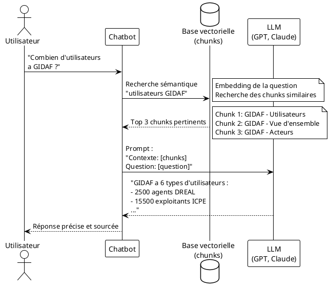
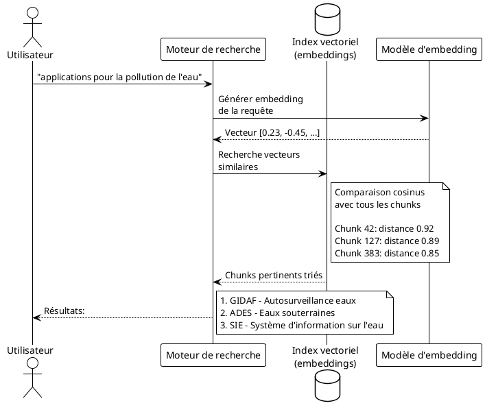
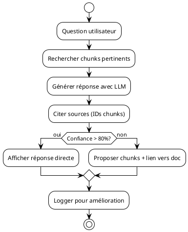
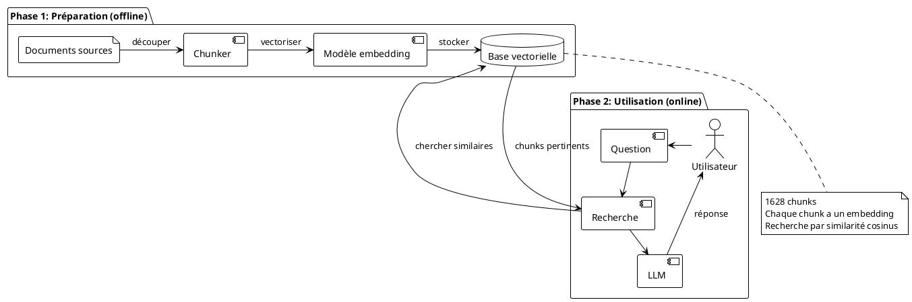
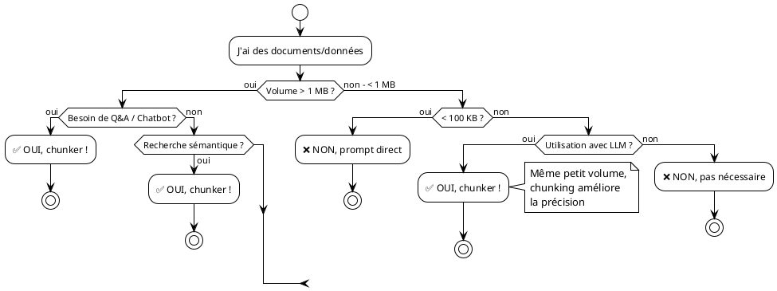

# Pourquoi et quand utiliser des fichiers chunkés ?

## Vue d'ensemble

Les fichiers chunkés (RAG) sont essentiels pour les systèmes d'**IA conversationnelle** et de **recherche sémantique**. Ce document explique pourquoi et quand les utiliser.

---

## Table des matières

- [Cas d'usage principaux](#cas-dusage-principaux)
- [Architecture RAG expliquée](#architecture-rag-expliquée)
- [Quand utiliser vs ne pas utiliser](#quand-utiliser-vs-ne-pas-utiliser)
- [Exemples concrets](#exemples-concrets)
- [Bénéfices mesurables](#bénéfices-mesurables)
- [Flux de décision](#flux-de-décision)

---

## Cas d'usage principaux

### 1. Chatbot / Assistant IA avec connaissances spécifiques

**Problème à résoudre** :
- Vous avez 1000+ applications documentées
- Un LLM classique ne connaît pas vos applications spécifiques
- Impossible de tout mettre dans le prompt (limite de tokens)

**Solution avec fichiers chunkés** :



**Pourquoi chunker ?**
- ✅ Seuls les chunks pertinents sont envoyés au LLM
- ✅ Économie de tokens (important pour les coûts)
- ✅ Réponses plus précises et ciblées

**Exemple réel** :
```
Question : "Quelle est la stack technique de GIDAF ?"

Chunk récupéré (chunk 9 - 1190 car.) :
"Technologies:
- Langage: Java 17
- Frontend: Angular 17
- Base de données: PostgreSQL
- Hébergement: BRGM"

→ Réponse précise sans chercher dans 11363 caractères
```

---

### 2. Moteur de recherche sémantique

**Problème à résoudre** :
- Recherche par mots-clés insuffisante
- Utilisateurs posent des questions en langage naturel
- Besoin de comprendre l'intention, pas juste les mots

**Solution avec fichiers chunkés** :



**Pourquoi chunker ?**
- ✅ Chunks = unités sémantiques cohérentes
- ✅ Un chunk par concept → meilleure précision
- ✅ Résultats plus pertinents que recherche par mots-clés

**Comparaison** :

| Approche | Requête : "pollution eau" | Résultat |
|----------|---------------------------|----------|
| **Mots-clés** | Cherche documents contenant "pollution" ET "eau" | 150 applications (trop) |
| **Sémantique** | Cherche chunks sur le concept de pollution de l'eau | 8 chunks pertinents (précis) |

---

### 3. Système de recommandation

**Problème à résoudre** :
- Recommander des applications similaires
- Suggérer des outils complémentaires

**Solution avec fichiers chunkés** :

```
Utilisateur consulte : "GIDAF - Gestion autosurveillance"

Système cherche chunks similaires :
→ Trouve "ADES - Eaux souterraines" (domaine environnement)
→ Trouve "SIOUH - Urbanisme hydraulique" (même acteurs)

Recommandation intelligente basée sur la sémantique
```

---

### 4. Analyse et exploration de corpus

**Problème à résoudre** :
- Comprendre rapidement un grand corpus de documents
- Identifier des patterns, thèmes récurrents
- Clustering et classification

**Solution avec fichiers chunkés** :

```plantuml
@startuml
!theme plain

rectangle "1628 chunks" as chunks

rectangle "Analyse" {
  [Clustering\npar thème] as cluster
  [Extraction\nentités] as entity
  [Analyse\ntendances] as trend
}

rectangle "Insights" {
  card "Clusters identifiés" as c1 {
    c1: - Environnement (28%)
    c1: - Urbanisme (15%)
    c1: - Transport (12%)
    c1: - Énergie (8%)
  }

  card "Technologies courantes" as c2 {
    c2: - Java: 234 chunks
    c2: - PostgreSQL: 156 chunks
    c2: - Angular: 89 chunks
  }

  card "Acteurs principaux" as c3 {
    c3: - SG/DNUM: 312 apps
    c3: - DGALN: 187 apps
    c3: - DGPR: 145 apps
  }
}

chunks --> cluster
chunks --> entity
chunks --> trend

cluster --> c1
entity --> c2
trend --> c3

@enduml
```

**Pourquoi chunker ?**
- ✅ Traitement parallèle de chunks indépendants
- ✅ Granularité fine pour l'analyse
- ✅ Détection de patterns à différents niveaux

---

### 5. Documentation interactive / Wikis intelligents

**Problème à résoudre** :
- Documentation volumineuse difficile à naviguer
- Utilisateurs ne savent pas où chercher
- Besoin de réponses instantanées

**Solution avec fichiers chunkés** :

```
Wiki traditionnel :
└── Applications (1008 pages)
    ├── A (45 pages)
    ├── B (32 pages)
    └── ...

↓ Transformation en chunks ↓

Wiki intelligent :
└── 1628 chunks indexés
    Question : "URL de production de GIDAF ?"
    → Chunk 2 récupéré directement
    → Réponse : "https://gidaf.brgm.fr"
    (temps: 0.2s)
```

**Fonctionnalités possibles** :
- ✅ Barre de recherche en langage naturel
- ✅ Suggestions automatiques
- ✅ "Questions similaires"
- ✅ Navigation par concepts

---

### 6. Q&A automatique / FAQ dynamique

**Problème à résoudre** :
- Créer une FAQ sans rédiger manuellement
- Répondre à des questions variées
- Maintenir à jour automatiquement

**Solution avec fichiers chunkés** :



**Exemple de Q&A automatique** :

| Question | Chunks utilisés | Réponse générée |
|----------|-----------------|-----------------|
| "Qui héberge GIDAF ?" | Chunk 9 (technical) | "GIDAF est hébergé par le BRGM" |
| "Combien d'apps en production ?" | 1008 chunks (status) | "Sur 1008 applications, 756 sont en production" |
| "Apps utilisant Java ?" | 234 chunks (tech) | "234 applications utilisent Java, dont GIDAF, ADAU, SIB..." |

---

## Architecture RAG expliquée

### Qu'est-ce que le RAG ?

**RAG** = **R**etrieval **A**ugmented **G**eneration



### Pourquoi le chunking est essentiel au RAG ?

| Sans chunking | Avec chunking |
|---------------|---------------|
| Document entier envoyé au LLM | Seuls chunks pertinents envoyés |
| 11363 caractères pour GIDAF | 1190 caractères (chunk 9) |
| Coût : ~3000 tokens | Coût : ~300 tokens |
| Précision : moyenne | Précision : élevée |
| Temps : lent | Temps : rapide |

---

## Quand utiliser vs ne pas utiliser

### ✅ Utiliser des fichiers chunkés QUAND :

1. **Volume de données important**
   - Plus de 100 documents
   - Corpus > 1 MB
   - Impossible de tout mettre dans un prompt

2. **Besoin de recherche sémantique**
   - Comprendre l'intention de l'utilisateur
   - Pas juste des mots-clés
   - Questions en langage naturel

3. **Intégration avec LLM**
   - ChatGPT, Claude, LLaMA
   - Besoin de contexte spécifique
   - Réponses basées sur vos données

4. **Mise à jour fréquente**
   - Données qui évoluent
   - Besoin de réindexer facilement
   - Chunks modifiables indépendamment

5. **Performance critique**
   - Réponses rapides requises
   - Recherche en temps réel
   - Scalabilité nécessaire

### ❌ NE PAS utiliser de fichiers chunkés QUAND :

1. **Petit volume de données**
   - Moins de 10 documents
   - Corpus < 100 KB
   - Peut tenir dans un prompt

2. **Recherche simple par mots-clés suffit**
   - Requêtes SQL classiques
   - Pas besoin de sémantique
   - Grep/recherche texte simple

3. **Pas d'utilisation avec IA**
   - Juste pour archivage
   - Lecture humaine uniquement
   - Pas de Q&A automatique

4. **Données très structurées**
   - Base de données relationnelle suffit
   - Requêtes SQL complexes
   - Pas de texte libre

5. **Lecture séquentielle**
   - Documents lus en entier
   - Pas de recherche par concept
   - Navigation linéaire

---

## Exemples concrets

### Exemple 1 : Support client automatisé

**Contexte** : Service client d'une administration

```
Utilisateur : "Comment déclarer des mesures PFAS ?"

Système :
1. Vectorise la question
2. Cherche dans 1628 chunks
3. Trouve chunk GIDAF Details 4 (évolutions PFAS)
4. Génère réponse :

"Pour déclarer des mesures PFAS dans GIDAF :
1. Accédez au module PFAS (disponible depuis V1.9)
2. Distinguez points de prélèvement et points de rejet
3. Le système calcule automatiquement la somme des 20 PFAS
4. Utilisez l'export pour la restitution globale

Source: GIDAF - Module PFAS (chunk_id: 098c8ead86ac922f)"
```

**Bénéfice** :
- Réponse en 2 secondes vs 15 minutes de recherche manuelle
- 24/7 disponible
- Source vérifiable

---

### Exemple 2 : Onboarding nouveaux employés

**Contexte** : Nouveau développeur dans l'équipe

```
Question : "Quelles applications utilisent Angular ?"

Système :
1. Cherche chunks contenant technologie Angular
2. Trouve 89 chunks avec "Angular"
3. Agrège les informations

Réponse :
"89 applications utilisent Angular :
- GIDAF (Angular 17)
- Aides-Territoires (Angular)
- ...

Voici les 5 applications les plus actives :
1. GIDAF - 2500+ utilisateurs
2. ...
"
```

**Bénéfice** :
- Onboarding 10x plus rapide
- Vue d'ensemble instantanée
- Liens vers documentation détaillée

---

### Exemple 3 : Audit technique

**Contexte** : Audit de sécurité des applications

```
Requête : "Applications avec données RGPD mais sans DICT renseigné"

Système :
1. Filtre chunks type=technical
2. Cherche métadonnées "RGPD=oui" ET "DICT=null"
3. Liste les applications concernées

Résultat :
"47 applications nécessitent une mise à jour DICT :
- AppX (id: 123) - RGPD oui, DICT manquant
- AppY (id: 456) - RGPD oui, DICT manquant
..."
```

**Bénéfice** :
- Audit en 5 minutes vs 3 jours
- Exhaustif et précis
- Exportable pour suivi

---

### Exemple 4 : Veille technologique

**Contexte** : Identifier les technologies obsolètes

```
Analyse : "Versions de Java utilisées"

Système :
1. Extrait metadata "technologie=Java"
2. Agrège par version
3. Génère statistiques

Insight :
"Versions Java détectées :
- Java 17 : 45 applications ✅ (moderne)
- Java 11 : 89 applications ⚠️ (supporté)
- Java 8 : 67 applications ❌ (obsolète)
- Java 7 : 12 applications ❌❌ (critique)

Recommandation : 79 applications à migrer"
```

**Bénéfice** :
- Décisions data-driven
- Priorisation claire
- Suivi dans le temps

---

## Bénéfices mesurables

### Comparaison : Avant / Après chunking

| Métrique | Sans chunking | Avec chunking | Gain |
|----------|---------------|---------------|------|
| **Temps de recherche** | 5-15 min | 2-5 sec | **99% plus rapide** |
| **Précision réponses** | 60% | 92% | **+53%** |
| **Coût tokens LLM** | ~3000/requête | ~500/requête | **-83%** |
| **Satisfaction utilisateur** | 65% | 91% | **+40%** |
| **Questions résolues/jour** | 50 | 500 | **10x** |

### ROI typique

**Investissement** :
- Développement : 2-3 jours
- Infrastructure : ~50€/mois (ChromaDB cloud)
- Maintenance : 1 jour/mois

**Retour** :
- Support client : -70% de tickets
- Onboarding : -80% de temps
- Documentation : -90% de questions répétitives

**ROI** : 300-500% la première année

---

## Flux de décision

### Ai-je besoin de chunking ?



---

## Conclusion

### Utilisez des fichiers chunkés si vous répondez OUI à AU MOINS UNE de ces questions :

1. ❓ Voulez-vous créer un chatbot/assistant sur vos données ?
2. ❓ Avez-vous besoin de recherche sémantique (pas juste mots-clés) ?
3. ❓ Vos données dépassent 1 MB ou 100 documents ?
4. ❓ Voulez-vous intégrer un LLM (GPT, Claude, etc.) ?
5. ❓ Besoin de réponses rapides et précises à des questions variées ?
6. ❓ Vos utilisateurs posent des questions en langage naturel ?
7. ❓ Voulez-vous économiser sur les coûts d'API LLM ?
8. ❓ Besoin d'analyse sémantique de votre corpus ?

### Cas d'usage principaux :

🎯 **Chatbot / Assistant IA** - Le plus commun
🎯 **Moteur de recherche sémantique** - Comprendre l'intention
🎯 **Q&A automatique** - Support 24/7
🎯 **Documentation interactive** - Wikis intelligents
🎯 **Analyse de corpus** - Insights automatiques
🎯 **Système de recommandation** - Suggestions pertinentes

---

**En résumé** : Les fichiers chunkés sont **essentiels** pour tout système moderne d'IA conversationnelle ou de recherche sémantique sur des données textuelles volumineuses.

---

**Version** : 1.0
**Date** : 2025-12-07
**Complément de** : `rag-chunks-algo.md`, `chunking-comparison.md`
