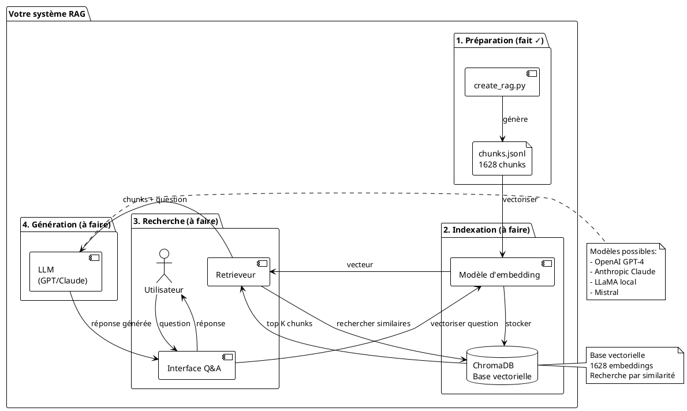

# Modules pour Q&A en langage naturel avec RAG

## Vue d'ensemble

Pour poser des questions en langage naturel sur vos chunks et obtenir des réponses précises, vous avez besoin d'une stack RAG complète.

---

## Table des matières

- [Architecture complète](#architecture-complète)
- [Modules Python requis](#modules-python-requis)
- [Installation](#installation)
- [Choix technologiques](#choix-technologiques)
- [Implémentation étape par étape](#implémentation-étape-par-étape)
- [Exemples d'utilisation](#exemples-dutilisation)

---

## Architecture complète



---

## Modules Python requis

### 1. Base vectorielle (obligatoire)

#### Option A : ChromaDB (recommandé - facile)

```bash
pip install chromadb
```

**Avantages** :
- ✅ Facile à utiliser
- ✅ Fonctionne en local
- ✅ Pas de serveur externe requis
- ✅ Gratuit et open-source
- ✅ Persistance sur disque

**Utilisation** :
```python
import chromadb

# Client local
client = chromadb.PersistentClient(path="./chroma_db")
collection = client.create_collection("applications")
```

#### Option B : FAISS (rapide, pour experts)

```bash
pip install faiss-cpu  # ou faiss-gpu pour GPU
```

**Avantages** :
- ✅ Très rapide
- ✅ Bon pour grands volumes
- ❌ Plus complexe à utiliser

#### Option C : Weaviate (production, cloud)

```bash
pip install weaviate-client
```

**Avantages** :
- ✅ Scalable
- ✅ Fonctionnalités avancées
- ❌ Nécessite serveur
- ❌ Payant en cloud

**Recommandation** : **ChromaDB** pour commencer

---

### 2. Modèle d'embedding (obligatoire)

#### Option A : Sentence Transformers (gratuit, local)

```bash
pip install sentence-transformers
```

**Modèles recommandés** :

| Modèle | Taille | Qualité | Vitesse | Usage |
|--------|--------|---------|---------|-------|
| `all-MiniLM-L6-v2` | 80 MB | Bonne | Rapide | ✅ Recommandé début |
| `all-mpnet-base-v2` | 420 MB | Très bonne | Moyenne | Production |
| `paraphrase-multilingual-MiniLM-L12-v2` | 420 MB | Bonne | Moyenne | Multilingue |

**Utilisation** :
```python
from sentence_transformers import SentenceTransformer

model = SentenceTransformer('all-MiniLM-L6-v2')
embedding = model.encode("Votre texte")
```

#### Option B : OpenAI Embeddings (payant, meilleure qualité)

```bash
pip install openai
```

**Modèle** : `text-embedding-3-small` ou `text-embedding-3-large`

**Coût** : ~0.0001$ pour 1000 tokens

**Utilisation** :
```python
from openai import OpenAI

client = OpenAI(api_key="sk-...")
response = client.embeddings.create(
    model="text-embedding-3-small",
    input="Votre texte"
)
embedding = response.data[0].embedding
```

**Recommandation** : **Sentence Transformers** (gratuit) pour commencer, OpenAI si budget

---

### 3. LLM pour génération (obligatoire)

#### Option A : OpenAI GPT (payant, facile)

```bash
pip install openai
```

**Modèles** :
- `gpt-4o` : Meilleure qualité (~0.03$/1K tokens)
- `gpt-4o-mini` : Bon rapport qualité/prix (~0.0015$/1K tokens)
- `gpt-3.5-turbo` : Économique (~0.0015$/1K tokens)

**Utilisation** :
```python
from openai import OpenAI

client = OpenAI(api_key="sk-...")
response = client.chat.completions.create(
    model="gpt-4o-mini",
    messages=[
        {"role": "system", "content": "Tu es un assistant..."},
        {"role": "user", "content": "Question + contexte"}
    ]
)
```

#### Option B : Anthropic Claude (payant, très bon)

```bash
pip install anthropic
```

**Modèles** :
- `claude-3-5-sonnet` : Excellent (~0.03$/1K tokens)
- `claude-3-haiku` : Rapide et économique (~0.0025$/1K tokens)

**Utilisation** :
```python
from anthropic import Anthropic

client = Anthropic(api_key="sk-ant-...")
response = client.messages.create(
    model="claude-3-5-sonnet-20241022",
    messages=[{"role": "user", "content": "Question"}]
)
```

#### Option C : LLaMA local (gratuit, nécessite GPU)

```bash
pip install llama-cpp-python
# ou
pip install transformers torch
```

**Modèles** :
- LLaMA 3.1 8B
- Mistral 7B
- Phi-3

**Avantages** :
- ✅ Gratuit
- ✅ Données restent locales
- ❌ Nécessite GPU (8-16 GB VRAM)
- ❌ Plus lent

**Recommandation** : **OpenAI GPT-4o-mini** (bon rapport qualité/prix)

---

### 4. Framework RAG (fortement recommandé)

#### Option A : LangChain (populaire, riche en fonctionnalités)

```bash
pip install langchain langchain-openai langchain-community
```

**Avantages** :
- ✅ Beaucoup d'intégrations
- ✅ Communauté active
- ✅ Patterns RAG prêts à l'emploi
- ❌ Peut être complexe

#### Option B : LlamaIndex (spécialisé RAG)

```bash
pip install llama-index
```

**Avantages** :
- ✅ Spécialisé pour RAG
- ✅ Plus simple que LangChain
- ✅ Bonne documentation

#### Option C : Sans framework (DIY)

Utiliser directement ChromaDB + OpenAI

**Avantages** :
- ✅ Contrôle total
- ✅ Léger
- ❌ Plus de code à écrire

**Recommandation** : **LangChain** pour débuter (beaucoup d'exemples)

---

### 5. Modules utilitaires

```bash
# Gestion des tokens
pip install tiktoken

# Validation et schémas
pip install pydantic

# Interface web (optionnel)
pip install streamlit  # ou gradio

# Logging et monitoring
pip install loguru

# Variables d'environnement
pip install python-dotenv
```

---

## Installation

### Installation complète (recommandée)

Créez un fichier `requirements-rag.txt` :

```txt
# Base vectorielle
chromadb==0.4.22

# Embeddings
sentence-transformers==2.3.1

# LLM
openai==1.12.0
# anthropic==0.18.1  # Alternative

# Framework RAG
langchain==0.1.9
langchain-openai==0.0.6
langchain-community==0.0.24

# Utilitaires
tiktoken==0.6.0
pydantic==2.6.1
python-dotenv==1.0.1
loguru==0.7.2

# Interface (optionnel)
streamlit==1.31.1

# Déjà installé dans votre projet
# (vérifiez pyproject.toml)
```

Installation :
```bash
pip install -r requirements-rag.txt
```

---

## Choix technologiques

### Stack recommandée pour débuter

```yaml
Configuration: Débutant / Prototype
Budget: ~10-50€/mois
Qualité: Bonne

Stack:
  - Base vectorielle: ChromaDB (gratuit, local)
  - Embeddings: Sentence Transformers (gratuit)
  - LLM: OpenAI GPT-4o-mini (0.15-1.50$/1K requêtes)
  - Framework: LangChain
  - Interface: Streamlit

Coût estimé:
  - Développement: 0€
  - 1000 questions/mois: ~5-20€
```

### Stack recommandée pour production

```yaml
Configuration: Production
Budget: ~100-500€/mois
Qualité: Excellente

Stack:
  - Base vectorielle: ChromaDB ou Weaviate Cloud
  - Embeddings: OpenAI text-embedding-3-large
  - LLM: OpenAI GPT-4o ou Claude 3.5 Sonnet
  - Framework: LangChain
  - Interface: API REST + Dashboard web
  - Monitoring: LangSmith ou Weights & Biases

Coût estimé:
  - Développement: 0€ (open source)
  - 10000 questions/mois: ~150-400€
```

### Stack gratuite (100% local)

```yaml
Configuration: Gratuit / Local
Budget: 0€
Qualité: Correcte (nécessite GPU)

Stack:
  - Base vectorielle: ChromaDB
  - Embeddings: Sentence Transformers
  - LLM: LLaMA 3.1 8B (local)
  - Framework: LangChain
  - Interface: Streamlit

Prérequis:
  - GPU avec 8-16 GB VRAM
  - 32 GB RAM recommandés
```

---

## Implémentation étape par étape

### Étape 1 : Indexer vos chunks

```python
# scripts/index_chunks.py

import chromadb
from sentence_transformers import SentenceTransformer
import json
from tqdm import tqdm

def index_chunks_to_chromadb(chunks_file, collection_name="applications"):
    """
    Indexe tous les chunks dans ChromaDB.
    """

    print("1. Initialisation ChromaDB...")
    client = chromadb.PersistentClient(path="./chroma_db")

    # Supprimer collection existante si nécessaire
    try:
        client.delete_collection(collection_name)
    except:
        pass

    collection = client.create_collection(
        name=collection_name,
        metadata={"description": "Chunks d'applications"}
    )

    print("2. Chargement modèle d'embedding...")
    model = SentenceTransformer('all-MiniLM-L6-v2')

    print("3. Lecture des chunks...")
    chunks = []
    with open(chunks_file, 'r', encoding='utf-8') as f:
        for line in f:
            chunks.append(json.loads(line))

    print(f"4. Indexation de {len(chunks)} chunks...")

    # Batch processing (plus rapide)
    batch_size = 100
    for i in tqdm(range(0, len(chunks), batch_size)):
        batch = chunks[i:i+batch_size]

        # Préparer données
        ids = [c['id'] for c in batch]
        documents = [c['content'] for c in batch]
        metadatas = [c['metadata'] for c in batch]

        # Générer embeddings
        embeddings = model.encode(documents).tolist()

        # Ajouter à ChromaDB
        collection.add(
            ids=ids,
            documents=documents,
            embeddings=embeddings,
            metadatas=metadatas
        )

    print(f"✓ {len(chunks)} chunks indexés avec succès !")
    return collection


if __name__ == '__main__':
    index_chunks_to_chromadb(
        'examples/test-mygusi/applications_rag_optimal.jsonl'
    )
```

### Étape 2 : Créer le système de Q&A

```python
# src/dyag/rag_query.py

import chromadb
from sentence_transformers import SentenceTransformer
from openai import OpenAI
import os
from typing import List, Dict

class RAGQuerySystem:
    """Système de Q&A avec RAG."""

    def __init__(
        self,
        chroma_path: str = "./chroma_db",
        collection_name: str = "applications",
        embedding_model: str = "all-MiniLM-L6-v2",
        llm_model: str = "gpt-4o-mini",
        openai_api_key: str = None
    ):
        # ChromaDB
        self.client = chromadb.PersistentClient(path=chroma_path)
        self.collection = self.client.get_collection(collection_name)

        # Modèle d'embedding
        self.embedding_model = SentenceTransformer(embedding_model)

        # LLM
        self.llm_model = llm_model
        self.openai_client = OpenAI(
            api_key=openai_api_key or os.getenv('OPENAI_API_KEY')
        )

    def search_chunks(
        self,
        query: str,
        n_results: int = 5,
        filter_metadata: Dict = None
    ) -> List[Dict]:
        """
        Recherche les chunks les plus pertinents.

        Args:
            query: Question en langage naturel
            n_results: Nombre de chunks à récupérer
            filter_metadata: Filtres optionnels (ex: {"source_id": "383"})

        Returns:
            Liste de chunks avec scores
        """
        # Générer embedding de la question
        query_embedding = self.embedding_model.encode(query).tolist()

        # Rechercher dans ChromaDB
        results = self.collection.query(
            query_embeddings=[query_embedding],
            n_results=n_results,
            where=filter_metadata
        )

        # Formater résultats
        chunks = []
        for i in range(len(results['ids'][0])):
            chunks.append({
                'id': results['ids'][0][i],
                'content': results['documents'][0][i],
                'metadata': results['metadatas'][0][i],
                'distance': results['distances'][0][i]
            })

        return chunks

    def generate_answer(
        self,
        question: str,
        chunks: List[Dict],
        system_prompt: str = None
    ) -> Dict:
        """
        Génère une réponse avec le LLM.

        Args:
            question: Question de l'utilisateur
            chunks: Chunks de contexte
            system_prompt: Prompt système personnalisé

        Returns:
            Réponse avec sources
        """
        # Construire le contexte
        context = "\n\n---\n\n".join([
            f"[Chunk {i+1} - ID: {c['id']}]\n{c['content']}"
            for i, c in enumerate(chunks)
        ])

        # Prompt système par défaut
        if system_prompt is None:
            system_prompt = """Tu es un assistant spécialisé dans les applications informatiques.
Réponds aux questions en te basant UNIQUEMENT sur le contexte fourni.
Si l'information n'est pas dans le contexte, dis-le clairement.
Cite toujours tes sources en indiquant les IDs des chunks utilisés."""

        # Prompt utilisateur
        user_prompt = f"""Contexte:
{context}

Question: {question}

Instructions:
- Réponds de manière précise et détaillée
- Base-toi UNIQUEMENT sur le contexte fourni
- Cite tes sources (IDs des chunks)
- Si tu ne sais pas, dis-le"""

        # Appel au LLM
        response = self.openai_client.chat.completions.create(
            model=self.llm_model,
            messages=[
                {"role": "system", "content": system_prompt},
                {"role": "user", "content": user_prompt}
            ],
            temperature=0.3,  # Précision > créativité
            max_tokens=1000
        )

        answer = response.choices[0].message.content

        return {
            'answer': answer,
            'sources': [c['id'] for c in chunks],
            'chunks_used': chunks,
            'model': self.llm_model,
            'tokens_used': response.usage.total_tokens
        }

    def ask(
        self,
        question: str,
        n_chunks: int = 5,
        filter_metadata: Dict = None
    ) -> Dict:
        """
        Méthode tout-en-un pour poser une question.

        Args:
            question: Question en langage naturel
            n_chunks: Nombre de chunks à utiliser comme contexte
            filter_metadata: Filtres optionnels

        Returns:
            Réponse complète avec sources
        """
        # 1. Rechercher chunks pertinents
        chunks = self.search_chunks(question, n_chunks, filter_metadata)

        # 2. Générer réponse
        result = self.generate_answer(question, chunks)

        # 3. Ajouter la question
        result['question'] = question

        return result


# Utilisation simple
if __name__ == '__main__':
    # Créer le système
    rag = RAGQuerySystem()

    # Poser une question
    result = rag.ask("Combien d'utilisateurs a GIDAF ?")

    print("Question:", result['question'])
    print("\nRéponse:", result['answer'])
    print("\nSources:", result['sources'])
    print(f"\nTokens utilisés: {result['tokens_used']}")
```

### Étape 3 : Interface utilisateur (Streamlit)

```python
# app.py

import streamlit as st
from src.dyag.rag_query import RAGQuerySystem
import json

# Configuration
st.set_page_config(
    page_title="Assistant Applications",
    page_icon="🤖",
    layout="wide"
)

# Initialiser le système RAG (mise en cache)
@st.cache_resource
def get_rag_system():
    return RAGQuerySystem()

rag = get_rag_system()

# Interface
st.title("🤖 Assistant Applications")
st.markdown("Posez vos questions sur les 1008 applications en langage naturel")

# Sidebar
with st.sidebar:
    st.header("Paramètres")
    n_chunks = st.slider("Nombre de chunks", 1, 10, 5)
    show_sources = st.checkbox("Afficher les sources", value=True)
    show_chunks = st.checkbox("Afficher les chunks", value=False)

# Zone de question
question = st.text_input(
    "Votre question :",
    placeholder="Ex: Combien d'utilisateurs a GIDAF ?"
)

if st.button("Rechercher", type="primary") or question:
    if question:
        with st.spinner("Recherche en cours..."):
            # Poser la question
            result = rag.ask(question, n_chunks=n_chunks)

        # Afficher la réponse
        st.success("Réponse")
        st.markdown(result['answer'])

        # Métadonnées
        col1, col2 = st.columns(2)
        with col1:
            st.metric("Chunks utilisés", len(result['sources']))
        with col2:
            st.metric("Tokens", result['tokens_used'])

        # Sources
        if show_sources:
            st.subheader("Sources")
            for chunk in result['chunks_used']:
                with st.expander(f"Chunk {chunk['id']} (distance: {chunk['distance']:.3f})"):
                    if show_chunks:
                        st.code(chunk['content'])
                    st.json(chunk['metadata'])

# Exemples de questions
st.markdown("---")
st.markdown("### Exemples de questions")

examples = [
    "Quelles sont les applications utilisant Java ?",
    "Combien d'utilisateurs a GIDAF ?",
    "Qui est le MOE de ADAU ?",
    "Liste les applications de biodiversité",
    "Quelle est la stack technique de GIDAF ?"
]

for ex in examples:
    if st.button(ex):
        st.rerun()
```

Lancement :
```bash
streamlit run app.py
```

---

## Exemples d'utilisation

### Exemple 1 : Question simple

```python
from src.dyag.rag_query import RAGQuerySystem

rag = RAGQuerySystem()

result = rag.ask("Qui héberge GIDAF ?")

print(result['answer'])
# "GIDAF est hébergé par le BRGM.
# Source: Chunk df20c22b60ac63d4"
```

### Exemple 2 : Question complexe

```python
result = rag.ask(
    "Liste les applications de biodiversité avec leurs utilisateurs",
    n_chunks=10
)

print(result['answer'])
# "Voici les applications de biodiversité identifiées :
#
# 1. SIB - 2000 agents et 20000 citoyens
# 2. SINP - [détails]
# 3. ONB - [détails]
#
# Sources: chunks 55293da6, 5ab2e6c2, ..."
```

### Exemple 3 : Filtrage par application

```python
result = rag.ask(
    "Quelles sont les technologies utilisées ?",
    filter_metadata={"source_id": "383"}  # Uniquement GIDAF
)

print(result['answer'])
# "GIDAF utilise les technologies suivantes :
# - Java 17
# - Angular 17
# - PostgreSQL
# ..."
```

### Exemple 4 : Batch de questions

```python
questions = [
    "Combien d'apps en production ?",
    "Quelles apps utilisent Angular ?",
    "Qui est le principal MOE ?"
]

for q in questions:
    result = rag.ask(q)
    print(f"Q: {q}")
    print(f"R: {result['answer']}\n")
```

---

## Commandes récapitulatives

```bash
# 1. Installation
pip install -r requirements-rag.txt

# 2. Indexation (une seule fois)
python scripts/index_chunks.py

# 3. Test en ligne de commande
python -c "
from src.dyag.rag_query import RAGQuerySystem
rag = RAGQuerySystem()
print(rag.ask('Qui héberge GIDAF ?')['answer'])
"

# 4. Lancer l'interface web
streamlit run app.py
```

---

## Prochaines étapes

1. ✅ Installer les modules
2. ✅ Indexer vos chunks
3. ✅ Tester le système Q&A
4. ⚙️ Affiner les prompts
5. ⚙️ Optimiser les paramètres (n_chunks, température)
6. 🚀 Déployer en production

---

**Version** : 1.0
**Date** : 2025-12-07
